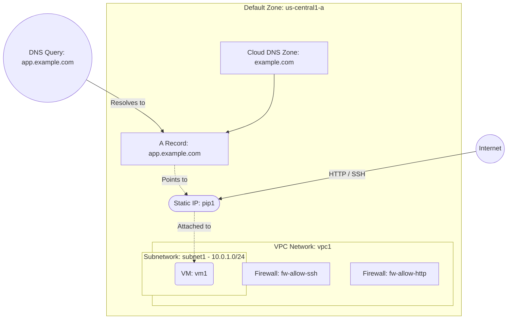

# Deploy a VM with Cloud DNS Zone and A Record on GCP

This guide demonstrates how to use MechCloud's stateless Infrastructure-as-Code (IaC) to provision a Compute Engine VM with a Cloud DNS managed zone and an A record pointing to the VM's static external IP on Google Cloud Platform.

In this scenario, we deploy a public-facing VM and configure a Cloud DNS managed zone with an A record to provide a human-readable domain name for the application. This pattern is commonly used when you want to manage DNS records for your domain directly within GCP.

## Scenario Overview
**Use Case:** Hosting a web application or API with a custom domain name managed via Cloud DNS, where DNS A records point directly to the VM's static external IP address.
**Key MechCloud Features Highlighted:**
- Zonal defaults injection (`zone: us-central1-a`)
- Hierarchical resource nesting (VPC $\rightarrow$ Subnetwork & Firewall)
- Cross-resource referencing (`ref:`)
- Cloud DNS zone and record set provisioning

### Architecture Diagram



***

## Step 1: Setting up Networking and Security

We create a VPC with a subnetwork and firewall rules allowing SSH from your IP and HTTP from the internet.

```yaml
defaults:
  zone: us-central1-a

resources:
  - type: compute.v1.network
    name: vpc1
    props:
      auto_create_subnetworks: false
    resources:
      - type: compute.v1.subnetwork
        name: subnet1
        props:
          ip_cidr_range: "10.0.1.0/24"

      - type: compute.v1.firewall
        name: fw-allow-ssh
        props:
          allowed:
            - ip_protocol: tcp
              ports:
                - "22"
          source_ranges:
            - "{{CURRENT_IP}}/32"

      - type: compute.v1.firewall
        name: fw-allow-http
        props:
          allowed:
            - ip_protocol: tcp
              ports:
                - "80"
          source_ranges:
            - "0.0.0.0/0"
```

## Step 2: Creating the Static IP and VM

We allocate a static external IP and deploy the VM with it attached.

```yaml
# ... (Continuing at the root resources level) ...
  - type: compute.v1.address
    name: pip1
    props:
      address_type: EXTERNAL

  - type: compute.v1.instance
    name: vm1
    props:
      machine_type: machineTypes/e2-micro
      disks:
        - boot: true
          auto_delete: true
          initialize_params:
            disk_size_gb: 30
            disk_type: diskTypes/pd-standard
            source_image: projects/ubuntu-os-cloud/global/images/family/ubuntu-2404-lts
      network_interfaces:
        - subnetwork: "ref:vpc1/subnet1"
          access_configs:
            - type: ONE_TO_ONE_NAT
              name: External NAT
              nat_ip: "ref:pip1"
```

## Step 3: Creating the Cloud DNS Zone and A Record

We provision a Cloud DNS managed zone for the domain and create a record set that maps a subdomain to the VM's static IP.

```yaml
# ... (Continuing at the root resources level) ...
  # Cloud DNS Managed Zone
  - type: dns.v1.managedZone
    name: example-zone
    props:
      dns_name: "example.com."
      description: "DNS zone for example.com"

  # A Record pointing to the VM's Static IP
  - type: dns.v1.resourceRecordSet
    name: app-record
    props:
      managed_zone: "ref:example-zone"
      name: "app.example.com."
      type: A
      ttl: 300
      rrdatas:
        - "ref:pip1.address"
```

### Complete Unified Template

For your convenience, here is the complete, unified MechCloud template combining all steps:

```yaml
defaults:
  zone: us-central1-a

resources:
  - type: compute.v1.network
    name: vpc1
    props:
      auto_create_subnetworks: false
    resources:
      - type: compute.v1.subnetwork
        name: subnet1
        props:
          ip_cidr_range: "10.0.1.0/24"

      - type: compute.v1.firewall
        name: fw-allow-ssh
        props:
          allowed:
            - ip_protocol: tcp
              ports:
                - "22"
          source_ranges:
            - "{{CURRENT_IP}}/32"

      - type: compute.v1.firewall
        name: fw-allow-http
        props:
          allowed:
            - ip_protocol: tcp
              ports:
                - "80"
          source_ranges:
            - "0.0.0.0/0"

  - type: compute.v1.address
    name: pip1
    props:
      address_type: EXTERNAL

  - type: compute.v1.instance
    name: vm1
    props:
      machine_type: machineTypes/e2-micro
      disks:
        - boot: true
          auto_delete: true
          initialize_params:
            disk_size_gb: 30
            disk_type: diskTypes/pd-standard
            source_image: projects/ubuntu-os-cloud/global/images/family/ubuntu-2404-lts
      network_interfaces:
        - subnetwork: "ref:vpc1/subnet1"
          access_configs:
            - type: ONE_TO_ONE_NAT
              name: External NAT
              nat_ip: "ref:pip1"

  - type: dns.v1.managedZone
    name: example-zone
    props:
      dns_name: "example.com."
      description: "DNS zone for example.com"

  - type: dns.v1.resourceRecordSet
    name: app-record
    props:
      managed_zone: "ref:example-zone"
      name: "app.example.com."
      type: A
      ttl: 300
      rrdatas:
        - "ref:pip1.address"
```
