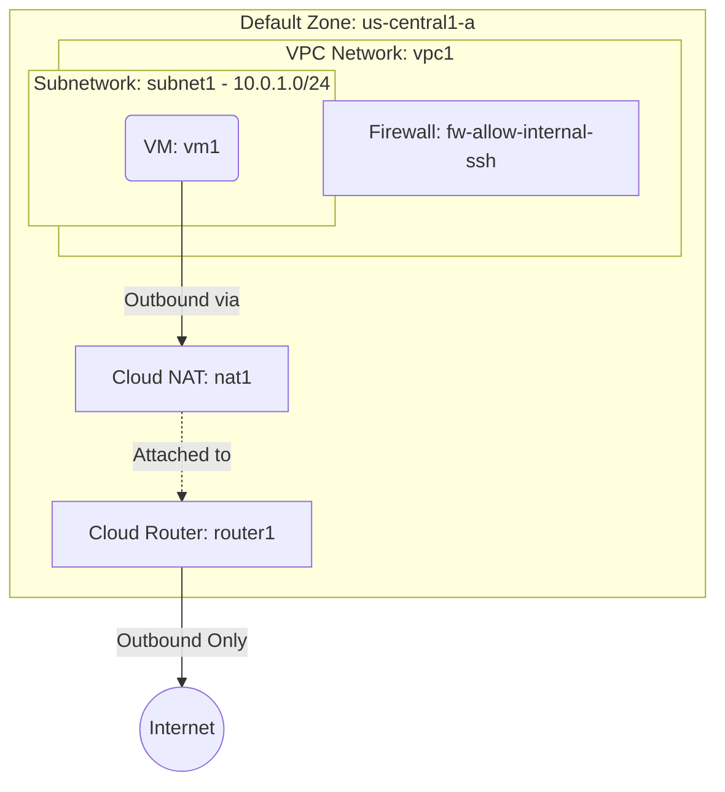

# Deploy a Private VM with Outbound Internet via Cloud NAT on GCP

This guide demonstrates how to use MechCloud's stateless Infrastructure-as-Code (IaC) to provision a private Compute Engine VM that accesses the internet for outbound traffic through Cloud NAT, without exposing any external IP on the VM.

In this scenario, we deploy a VM with no external IP that uses a Cloud NAT gateway attached to a Cloud Router for outbound connectivity. This is ideal for workloads that need to pull updates, call external APIs, or push data to external services while remaining completely unreachable from the internet.

## Scenario Overview
**Use Case:** Backend workers, batch processing nodes, or application servers that need outbound internet access (e.g., downloading packages, calling external APIs) but must not have any inbound public exposure.
**Key MechCloud Features Highlighted:**
- Zonal defaults injection (`zone: us-central1-a`)
- Hierarchical resource nesting (VPC $\rightarrow$ Subnetwork & Firewall)
- Cross-resource referencing (`ref:`)
- Cloud Router and Cloud NAT for outbound-only internet access

### Architecture Diagram



***

## Step 1: Setting up Networking

We create a custom VPC with a subnetwork and a firewall rule allowing SSH from within the VPC only.

```yaml
defaults:
  zone: us-central1-a

resources:
  - type: compute.v1.network
    name: vpc1
    props:
      auto_create_subnetworks: false
    resources:
      - type: compute.v1.subnetwork
        name: subnet1
        props:
          ip_cidr_range: "10.0.1.0/24"

      - type: compute.v1.firewall
        name: fw-allow-internal-ssh
        props:
          allowed:
            - ip_protocol: tcp
              ports:
                - "22"
          source_ranges:
            - "10.0.1.0/24"
```

## Step 2: Creating Cloud Router and Cloud NAT

We provision a Cloud Router and attach a Cloud NAT gateway to it. The NAT is configured to automatically allocate external IPs for outbound traffic from all subnetworks in the VPC.

```yaml
# ... (Continuing at the root resources level) ...
  # Cloud Router (required by Cloud NAT)
  - type: compute.v1.router
    name: router1
    props:
      network: "ref:vpc1"
      region: us-central1

  # Cloud NAT
  - type: compute.v1.routerNat
    name: nat1
    props:
      router: "ref:router1"
      region: us-central1
      nat_ip_allocate_option: AUTO_ONLY
      source_subnetwork_ip_ranges_to_nat: ALL_SUBNETWORKS_ALL_IP_RANGES
      log_config:
        enable: true
        filter: ERRORS_ONLY
```

## Step 3: Provisioning the Private VM

We deploy a VM with no external IP (no `access_configs`). It can still reach the internet outbound through Cloud NAT.

```yaml
# ... (Continuing at the root resources level) ...
  - type: compute.v1.instance
    name: vm1
    props:
      machine_type: machineTypes/e2-micro
      disks:
        - boot: true
          auto_delete: true
          initialize_params:
            disk_size_gb: 30
            disk_type: diskTypes/pd-standard
            source_image: projects/ubuntu-os-cloud/global/images/family/ubuntu-2404-lts
      network_interfaces:
        - subnetwork: "ref:vpc1/subnet1"
```

### Complete Unified Template

For your convenience, here is the complete, unified MechCloud template combining all steps:

```yaml
defaults:
  zone: us-central1-a

resources:
  - type: compute.v1.network
    name: vpc1
    props:
      auto_create_subnetworks: false
    resources:
      - type: compute.v1.subnetwork
        name: subnet1
        props:
          ip_cidr_range: "10.0.1.0/24"

      - type: compute.v1.firewall
        name: fw-allow-internal-ssh
        props:
          allowed:
            - ip_protocol: tcp
              ports:
                - "22"
          source_ranges:
            - "10.0.1.0/24"

  - type: compute.v1.router
    name: router1
    props:
      network: "ref:vpc1"
      region: us-central1

  - type: compute.v1.routerNat
    name: nat1
    props:
      router: "ref:router1"
      region: us-central1
      nat_ip_allocate_option: AUTO_ONLY
      source_subnetwork_ip_ranges_to_nat: ALL_SUBNETWORKS_ALL_IP_RANGES
      log_config:
        enable: true
        filter: ERRORS_ONLY

  - type: compute.v1.instance
    name: vm1
    props:
      machine_type: machineTypes/e2-micro
      disks:
        - boot: true
          auto_delete: true
          initialize_params:
            disk_size_gb: 30
            disk_type: diskTypes/pd-standard
            source_image: projects/ubuntu-os-cloud/global/images/family/ubuntu-2404-lts
      network_interfaces:
        - subnetwork: "ref:vpc1/subnet1"
```
