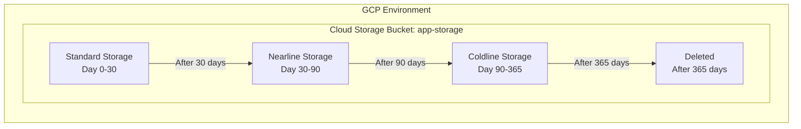

# Deploy a Cloud Storage Bucket with Lifecycle Rules on GCP

This guide demonstrates how to use MechCloud's stateless Infrastructure-as-Code (IaC) to provision a Google Cloud Storage bucket with lifecycle management rules for automated data retention and cost optimization.

In this scenario, we create a Cloud Storage bucket configured with lifecycle rules that automatically transition objects to cheaper storage classes as they age and delete them after a retention period. This is a common pattern for log storage, backup retention, and data archival.

## Scenario Overview
**Use Case:** Setting up cloud object storage for application logs, backups, or data archival with automated lifecycle policies that move data to cheaper storage tiers and eventually delete expired objects.
**Key MechCloud Features Highlighted:**
- Non-compute GCP resource provisioning
- Lifecycle management rules
- Storage class transitions

### Architecture Diagram



***

## Step 1: Creating the Cloud Storage Bucket

We provision a Cloud Storage bucket with Standard storage class, uniform bucket-level access for simplified permissions, and versioning enabled.

```yaml
resources:
  # 1. Cloud Storage Bucket
  - type: storage.v1.bucket
    name: app-storage
    props:
      storage_class: STANDARD
      location: US
      iam_configuration:
        uniform_bucket_level_access:
          enabled: true
      versioning:
        enabled: true
```

## Step 2: Adding Lifecycle Rules

We configure lifecycle rules to automatically transition objects to cheaper storage classes and delete them after the retention period expires.

```yaml
# ... (Continuing with the bucket props) ...
      lifecycle:
        rule:
          # Move to Nearline after 30 days
          - action:
              type: SetStorageClass
              storage_class: NEARLINE
            condition:
              age: 30
          # Move to Coldline after 90 days
          - action:
              type: SetStorageClass
              storage_class: COLDLINE
            condition:
              age: 90
          # Delete after 365 days
          - action:
              type: Delete
            condition:
              age: 365
          # Delete old object versions after 30 days
          - action:
              type: Delete
            condition:
              age: 30
              is_live: false
```

### Complete Unified Template

For your convenience, here is the complete, unified MechCloud template combining all steps:

```yaml
resources:
  - type: storage.v1.bucket
    name: app-storage
    props:
      storage_class: STANDARD
      location: US
      iam_configuration:
        uniform_bucket_level_access:
          enabled: true
      versioning:
        enabled: true
      lifecycle:
        rule:
          - action:
              type: SetStorageClass
              storage_class: NEARLINE
            condition:
              age: 30
          - action:
              type: SetStorageClass
              storage_class: COLDLINE
            condition:
              age: 90
          - action:
              type: Delete
            condition:
              age: 365
          - action:
              type: Delete
            condition:
              age: 30
              is_live: false
```
