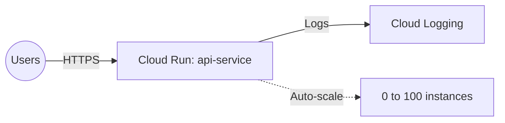

# Deploy a Cloud Run Service with Custom Domain on GCP

This guide demonstrates how to use MechCloud's stateless IaC to provision a Cloud Run service for running containerized applications in a fully managed serverless environment.

## Scenario Overview
**Use Case:** A fully managed serverless container platform that automatically scales from zero — ideal for web APIs, microservices, and event-driven applications that need fast cold starts, per-request billing, and zero infrastructure management.
**Key MechCloud Features Highlighted:**
- Cross-resource referencing (`ref:`)
- Service configuration with scaling and traffic
- IAM for public/private access control

### Architecture Diagram



***

### Complete Unified Template

```yaml
resources:
  - type: gcp_service_account
    name: run-sa
    props:
      account_id: "mc-cloud-run-sa"
      display_name: "Cloud Run Service Account"

  - type: gcp_project_iam_member
    name: run-logging
    props:
      role: roles/logging.logWriter
      member: "serviceAccount:ref:run-sa.email"

  - type: gcp_project_iam_member
    name: run-metrics
    props:
      role: roles/monitoring.metricWriter
      member: "serviceAccount:ref:run-sa.email"

  - type: gcp_cloud_run_v2_service
    name: api-service
    props:
      location: "{{CURRENT_REGION}}"
      ingress: INGRESS_TRAFFIC_ALL
      template:
        service_account: "ref:run-sa.email"
        scaling:
          min_instance_count: 0
          max_instance_count: 100
        containers:
          - image: "gcr.io/cloudrun/hello"
            ports:
              - container_port: 8080
            resources:
              limits:
                cpu: "1"
                memory: "512Mi"
            env:
              - name: ENVIRONMENT
                value: production
            startup_probe:
              http_get:
                path: "/"
              initial_delay_seconds: 0
              period_seconds: 3
              failure_threshold: 3
            liveness_probe:
              http_get:
                path: "/health"
              period_seconds: 30
      traffic:
        - type: TRAFFIC_TARGET_ALLOCATION_TYPE_LATEST
          percent: 100

  - type: gcp_cloud_run_service_iam_member
    name: public-access
    props:
      location: "{{CURRENT_REGION}}"
      service: "ref:api-service"
      role: roles/run.invoker
      member: allUsers
```
