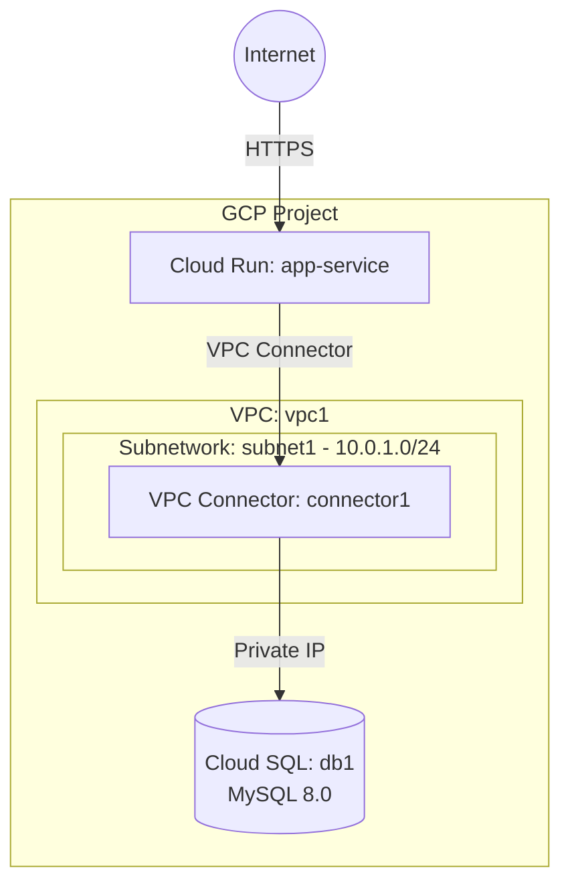

# Deploy a Cloud Run Service with Cloud SQL on GCP

This guide demonstrates how to use MechCloud's stateless Infrastructure-as-Code (IaC) to provision a Cloud Run service connected to a Cloud SQL MySQL instance on Google Cloud Platform.

In this scenario, we deploy a serverless Cloud Run service that connects to a Cloud SQL database via the built-in Cloud SQL proxy. This is a common pattern for deploying scalable web applications and APIs backed by a managed relational database, without managing any infrastructure.

## Scenario Overview
**Use Case:** A serverless web application or API that automatically scales to zero when idle and scales up to handle traffic spikes, backed by a fully managed Cloud SQL database for persistent data storage.
**Key MechCloud Features Highlighted:**
- Cross-resource referencing (`ref:`)
- Serverless compute (Cloud Run) with managed database (Cloud SQL)
- VPC connector for private connectivity

### Architecture Diagram



***

### Complete Unified Template

```yaml
resources:
  - type: google_compute_network
    name: vpc1
    props:
      auto_create_subnetworks: false
    resources:
      - type: google_compute_subnetwork
        name: subnet1
        props:
          ip_cidr_range: "10.0.1.0/24"
          region: us-central1

  - type: google_vpc_access_connector
    name: connector1
    props:
      region: us-central1
      network: "ref:vpc1"
      ip_cidr_range: "10.8.0.0/28"
      min_throughput: 200
      max_throughput: 300

  - type: google_sql_database_instance
    name: db1
    props:
      database_version: MYSQL_8_0
      region: us-central1
      settings:
        tier: db-f1-micro
        ip_configuration:
          ipv4_enabled: false
          private_network: "ref:vpc1"
        backup_configuration:
          enabled: true
          binary_log_enabled: true
      deletion_protection: false
    resources:
      - type: google_sql_database
        name: appdb
        props:
          charset: utf8mb4

      - type: google_sql_user
        name: app-user
        props:
          name: appuser
          password: "ChangeMe123!"

  - type: google_cloud_run_v2_service
    name: app-service
    props:
      location: us-central1
      ingress: INGRESS_TRAFFIC_ALL
      template:
        vpc_access:
          connector: "ref:connector1"
          egress: PRIVATE_RANGES_ONLY
        containers:
          - image: "us-docker.pkg.dev/cloudrun/container/hello"
            ports:
              - container_port: 8080
            env:
              - name: DB_HOST
                value: "ref:db1.private_ip_address"
              - name: DB_NAME
                value: appdb
              - name: DB_USER
                value: appuser
            resources:
              limits:
                cpu: "1"
                memory: "512Mi"
        scaling:
          min_instance_count: 0
          max_instance_count: 10
```
