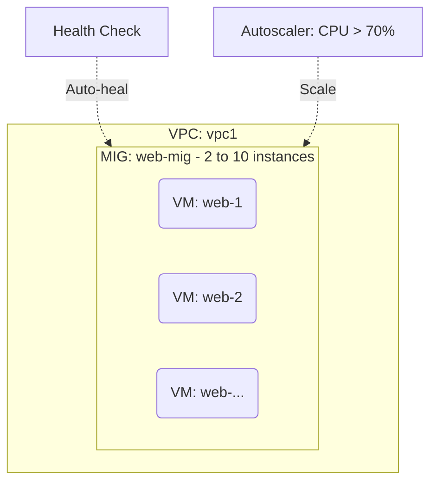

# Deploy a Managed Instance Group with Autoscaler on GCP

This guide demonstrates how to use MechCloud's stateless IaC to provision a Managed Instance Group (MIG) with an autoscaler for automatically scaling VM instances based on load.

## Scenario Overview
**Use Case:** A horizontally scalable application tier where VMs are automatically created and destroyed based on CPU utilization — ensuring consistent performance during traffic spikes while minimizing costs during idle periods.
**Key MechCloud Features Highlighted:**
- Cross-resource referencing (`ref:`)
- Instance template and autoscaler configuration as clean YAML
- Health check integration for auto-healing

### Architecture Diagram



***

### Complete Unified Template

```yaml
resources:
  - type: gcp_compute_network
    name: vpc1
    props:
      auto_create_subnetworks: false
    resources:
      - type: gcp_compute_subnetwork
        name: subnet1
        props:
          ip_cidr_range: "10.0.1.0/24"
          region: "{{CURRENT_REGION}}"
      - type: gcp_compute_firewall
        name: fw-http
        props:
          direction: INGRESS
          allow:
            - protocol: tcp
              ports:
                - "80"
          source_ranges:
            - "0.0.0.0/0"
          target_tags:
            - web-server
      - type: gcp_compute_firewall
        name: fw-health-check
        props:
          direction: INGRESS
          allow:
            - protocol: tcp
              ports:
                - "80"
          source_ranges:
            - "130.211.0.0/22"
            - "35.191.0.0/16"
          target_tags:
            - web-server

  - type: gcp_compute_instance_template
    name: web-template
    props:
      machine_type: "e2-standard-2"
      tags:
        - web-server
      disk:
        - source_image: "ubuntu-os-cloud/ubuntu-2404-lts-amd64"
          auto_delete: true
          boot: true
          disk_size_gb: 20
      network_interface:
        - subnetwork: "ref:vpc1/subnet1"
      metadata:
        startup-script: |
          #!/bin/bash
          apt-get update && apt-get install -y nginx
          systemctl enable nginx && systemctl start nginx

  - type: gcp_compute_health_check
    name: http-hc
    props:
      http_health_check:
        port: 80
        request_path: "/"
      check_interval_sec: 10
      timeout_sec: 5
      healthy_threshold: 2
      unhealthy_threshold: 3

  - type: gcp_compute_region_instance_group_manager
    name: web-mig
    props:
      region: "{{CURRENT_REGION}}"
      base_instance_name: "mc-web"
      version:
        - instance_template: "ref:web-template"
      target_size: 2
      named_port:
        - name: http
          port: 80
      auto_healing_policies:
        - health_check: "ref:http-hc"
          initial_delay_sec: 300

  - type: gcp_compute_region_autoscaler
    name: web-autoscaler
    props:
      region: "{{CURRENT_REGION}}"
      target: "ref:web-mig"
      autoscaling_policy:
        min_replicas: 2
        max_replicas: 10
        cpu_utilization:
          target: 0.7
        cooldown_period: 60
```
