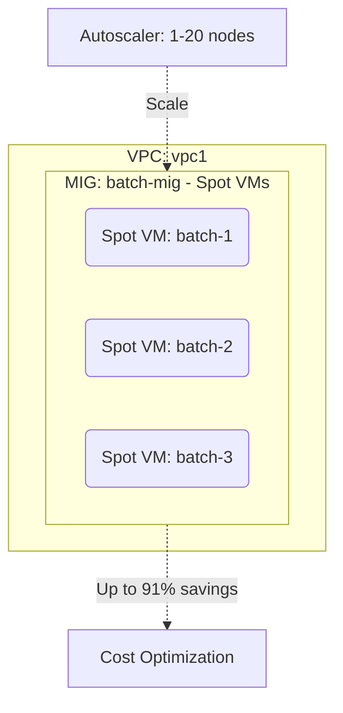

# Deploy a Preemptible (Spot) VM Instance Group on GCP

This guide demonstrates how to use MechCloud's stateless IaC to provision a Managed Instance Group with preemptible (Spot) VMs for cost-optimized batch and fault-tolerant workloads.

## Scenario Overview
**Use Case:** Running batch processing, data analysis, CI/CD builds, or rendering jobs on Spot VMs at up to 91% discount — ideal for fault-tolerant workloads that can handle interruptions and benefit from massive cost savings.
**Key MechCloud Features Highlighted:**
- Cross-resource referencing (`ref:`)
- Spot VM provisioning model configuration
- Instance template with preemptible scheduling

### Architecture Diagram



***

### Complete Unified Template

```yaml
resources:
  - type: gcp_compute_network
    name: vpc1
    props:
      auto_create_subnetworks: false
    resources:
      - type: gcp_compute_subnetwork
        name: subnet1
        props:
          ip_cidr_range: "10.0.1.0/24"
          region: "{{CURRENT_REGION}}"
      - type: gcp_compute_firewall
        name: fw-ssh
        props:
          direction: INGRESS
          allow:
            - protocol: tcp
              ports:
                - "22"
          source_ranges:
            - "{{CURRENT_IP}}/32"

  - type: gcp_compute_instance_template
    name: spot-template
    props:
      machine_type: "e2-standard-4"
      disk:
        - source_image: "ubuntu-os-cloud/ubuntu-2404-lts-amd64"
          auto_delete: true
          boot: true
          disk_size_gb: 50
      network_interface:
        - subnetwork: "ref:vpc1/subnet1"
      scheduling:
        preemptible: true
        automatic_restart: false
        provisioning_model: SPOT
        instance_termination_action: STOP
      metadata:
        startup-script: |
          #!/bin/bash
          echo "Spot instance started at $(date)" >> /var/log/spot-startup.log

  - type: gcp_compute_region_instance_group_manager
    name: batch-mig
    props:
      region: "{{CURRENT_REGION}}"
      base_instance_name: "mc-spot-batch"
      version:
        - instance_template: "ref:spot-template"
      target_size: 3

  - type: gcp_compute_region_autoscaler
    name: batch-autoscaler
    props:
      region: "{{CURRENT_REGION}}"
      target: "ref:batch-mig"
      autoscaling_policy:
        min_replicas: 1
        max_replicas: 20
        cpu_utilization:
          target: 0.8
        cooldown_period: 60
```
