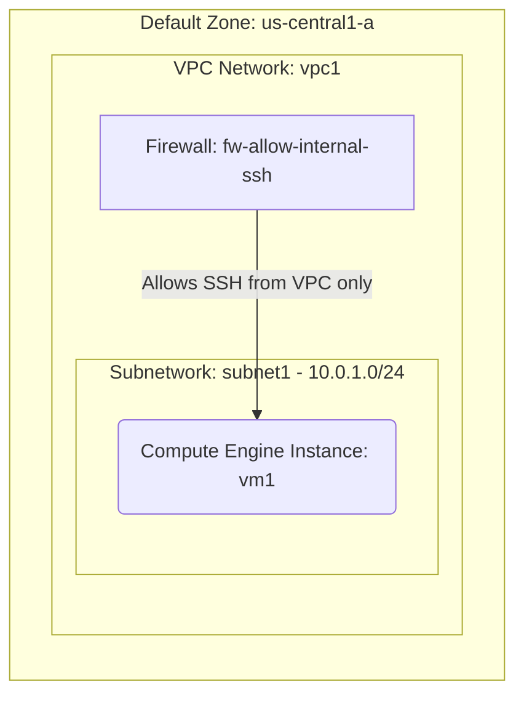

# Deploy a Private VM without an External IP on GCP

This guide demonstrates how to use MechCloud's stateless Infrastructure-as-Code (IaC) to provision a private Compute Engine VM on Google Cloud Platform that has no external IP address and is not directly reachable from the internet.

In this scenario, we provision a VM inside a custom VPC Network with only an internal IP address. Firewall rules restrict SSH access to only sources within the VPC's internal IP range. This is a common pattern for backend services, databases, or worker nodes that should not be publicly accessible.

## Scenario Overview
**Use Case:** Deploying an internal backend service, database server, or worker node that should only be accessible from within the VPC or via IAP tunneling.
**Key MechCloud Features Highlighted:**
- Zonal defaults injection (`zone: us-central1-a`)
- Hierarchical resource nesting (VPC $\rightarrow$ Subnetwork & Firewall)
- Automatic parent-link inference
- Cross-resource referencing (`ref:`)

### Architecture Diagram



***

## Step 1: Setting up Networking and Security

We create a custom VPC Network with a subnetwork. The firewall rule only allows SSH access from within the VPC's internal CIDR range.

```yaml
defaults:
  zone: us-central1-a

resources:
  # 1. Define the VPC Network
  - type: compute.v1.network
    name: vpc1
    props:
      auto_create_subnetworks: false
    resources:
      # 2. Define the Subnetwork
      - type: compute.v1.subnetwork
        name: subnet1
        props:
          ip_cidr_range: "10.0.1.0/24"

      # 3. Firewall rule for internal SSH only
      - type: compute.v1.firewall
        name: fw-allow-internal-ssh
        props:
          allowed:
            - ip_protocol: tcp
              ports:
                - "22"
          source_ranges:
            - "10.0.1.0/24"
```

## Step 2: Provisioning the Private VM

We create a VM with no `access_configs` block in the network interface, which means it will not receive an external IP address.

```yaml
# ... (Continuing at the root resources level) ...
  # 4. Private VM (no external IP)
  - type: compute.v1.instance
    name: vm1
    props:
      machine_type: machineTypes/e2-micro
      disks:
        - boot: true
          auto_delete: true
          initialize_params:
            disk_size_gb: 30
            disk_type: diskTypes/pd-standard
            source_image: projects/ubuntu-os-cloud/global/images/family/ubuntu-2404-lts
      network_interfaces:
        - subnetwork: "ref:vpc1/subnet1"
```

### Complete Unified Template

For your convenience, here is the complete, unified MechCloud template combining all steps:

```yaml
defaults:
  zone: us-central1-a

resources:
  - type: compute.v1.network
    name: vpc1
    props:
      auto_create_subnetworks: false
    resources:
      - type: compute.v1.subnetwork
        name: subnet1
        props:
          ip_cidr_range: "10.0.1.0/24"

      - type: compute.v1.firewall
        name: fw-allow-internal-ssh
        props:
          allowed:
            - ip_protocol: tcp
              ports:
                - "22"
          source_ranges:
            - "10.0.1.0/24"

  - type: compute.v1.instance
    name: vm1
    props:
      machine_type: machineTypes/e2-micro
      disks:
        - boot: true
          auto_delete: true
          initialize_params:
            disk_size_gb: 30
            disk_type: diskTypes/pd-standard
            source_image: projects/ubuntu-os-cloud/global/images/family/ubuntu-2404-lts
      network_interfaces:
        - subnetwork: "ref:vpc1/subnet1"
```
