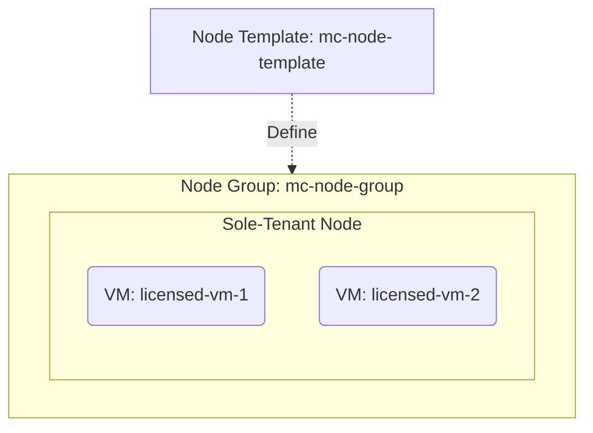

# Deploy a Sole-Tenant Node for Dedicated Hardware on GCP

This guide demonstrates how to use MechCloud's stateless IaC to provision a sole-tenant node for running VMs on dedicated physical hardware isolated from other tenants.

## Scenario Overview
**Use Case:** Running workloads on dedicated physical servers for BYOL (Bring Your Own License) compliance, regulatory requirements, or performance isolation — sole-tenant nodes ensure your VMs do not share hardware with other customers.
**Key MechCloud Features Highlighted:**
- Cross-resource referencing (`ref:`)
- Node template and node group configuration
- Affinity labels for VM placement

### Architecture Diagram



***

### Complete Unified Template

```yaml
resources:
  - type: gcp_compute_network
    name: vpc1
    props:
      auto_create_subnetworks: false
    resources:
      - type: gcp_compute_subnetwork
        name: subnet1
        props:
          ip_cidr_range: "10.0.1.0/24"
          region: "{{CURRENT_REGION}}"
      - type: gcp_compute_firewall
        name: fw-ssh
        props:
          direction: INGRESS
          allow:
            - protocol: tcp
              ports:
                - "22"
          source_ranges:
            - "{{CURRENT_IP}}/32"

  - type: gcp_compute_node_template
    name: mc-node-template
    props:
      region: "{{CURRENT_REGION}}"
      node_type: "n2-node-80-640"
      node_affinity_labels:
        workload: licensed

  - type: gcp_compute_node_group
    name: mc-node-group
    props:
      zone: "{{CURRENT_REGION}}-a"
      node_template: "ref:mc-node-template"
      size: 1
      autoscaling_policy:
        mode: ON
        min_nodes: 1
        max_nodes: 3
      maintenance_policy: RESTART_IN_PLACE

  - type: gcp_compute_instance
    name: licensed-vm-1
    props:
      machine_type: "n2-standard-16"
      zone: "{{CURRENT_REGION}}-a"
      boot_disk:
        initialize_params:
          image: "ubuntu-os-cloud/ubuntu-2404-lts-amd64"
      network_interface:
        - subnetwork: "ref:vpc1/subnet1"
      scheduling:
        node_affinities:
          - key: workload
            operator: IN
            values:
              - licensed

  - type: gcp_compute_instance
    name: licensed-vm-2
    props:
      machine_type: "n2-standard-16"
      zone: "{{CURRENT_REGION}}-a"
      boot_disk:
        initialize_params:
          image: "ubuntu-os-cloud/ubuntu-2404-lts-amd64"
      network_interface:
        - subnetwork: "ref:vpc1/subnet1"
      scheduling:
        node_affinities:
          - key: workload
            operator: IN
            values:
              - licensed
```
