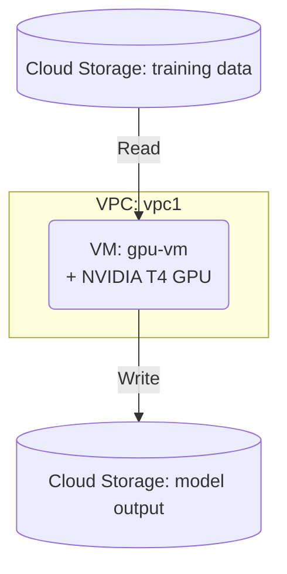

# Deploy a VM with GPU Accelerator on GCP

This guide demonstrates how to use MechCloud's stateless IaC to provision a Compute Engine VM with an attached GPU accelerator for machine learning, rendering, and HPC workloads.

## Scenario Overview
**Use Case:** Running GPU-intensive workloads like deep learning training, video transcoding, scientific simulations, or 3D rendering — attaching NVIDIA GPUs to VMs provides massive parallel processing power without dedicated hardware.
**Key MechCloud Features Highlighted:**
- Cross-resource referencing (`ref:`)
- GPU accelerator configuration as clean YAML
- Custom machine type and disk configuration

### Architecture Diagram



***

### Complete Unified Template

```yaml
resources:
  - type: gcp_compute_network
    name: vpc1
    props:
      auto_create_subnetworks: false
    resources:
      - type: gcp_compute_subnetwork
        name: subnet1
        props:
          ip_cidr_range: "10.0.1.0/24"
          region: "{{CURRENT_REGION}}"
      - type: gcp_compute_firewall
        name: fw-ssh
        props:
          direction: INGRESS
          allow:
            - protocol: tcp
              ports:
                - "22"
          source_ranges:
            - "{{CURRENT_IP}}/32"
      - type: gcp_compute_firewall
        name: fw-jupyter
        props:
          direction: INGRESS
          allow:
            - protocol: tcp
              ports:
                - "8888"
          source_ranges:
            - "{{CURRENT_IP}}/32"
          target_tags:
            - gpu-vm

  - type: gcp_compute_address
    name: gpu-ip
    props:
      region: "{{CURRENT_REGION}}"

  - type: gcp_compute_instance
    name: gpu-vm
    props:
      machine_type: "n1-standard-8"
      zone: "{{CURRENT_REGION}}-a"
      tags:
        - gpu-vm
      guest_accelerator:
        - type: "nvidia-tesla-t4"
          count: 1
      scheduling:
        on_host_maintenance: TERMINATE
        automatic_restart: true
      boot_disk:
        initialize_params:
          image: "deeplearning-platform-release/common-cu121-v20240128-debian-11"
          size: 200
          type: pd-ssd
      network_interface:
        - subnetwork: "ref:vpc1/subnet1"
          access_config:
            - nat_ip: "ref:gpu-ip"
      metadata:
        install-nvidia-driver: "True"
        startup-script: |
          #!/bin/bash
          echo "GPU VM started at $(date)" >> /var/log/gpu-startup.log

  - type: gcp_storage_bucket
    name: ml-data
    props:
      location: "{{CURRENT_REGION}}"
      uniform_bucket_level_access: true

  - type: gcp_storage_bucket
    name: ml-output
    props:
      location: "{{CURRENT_REGION}}"
      uniform_bucket_level_access: true
```
