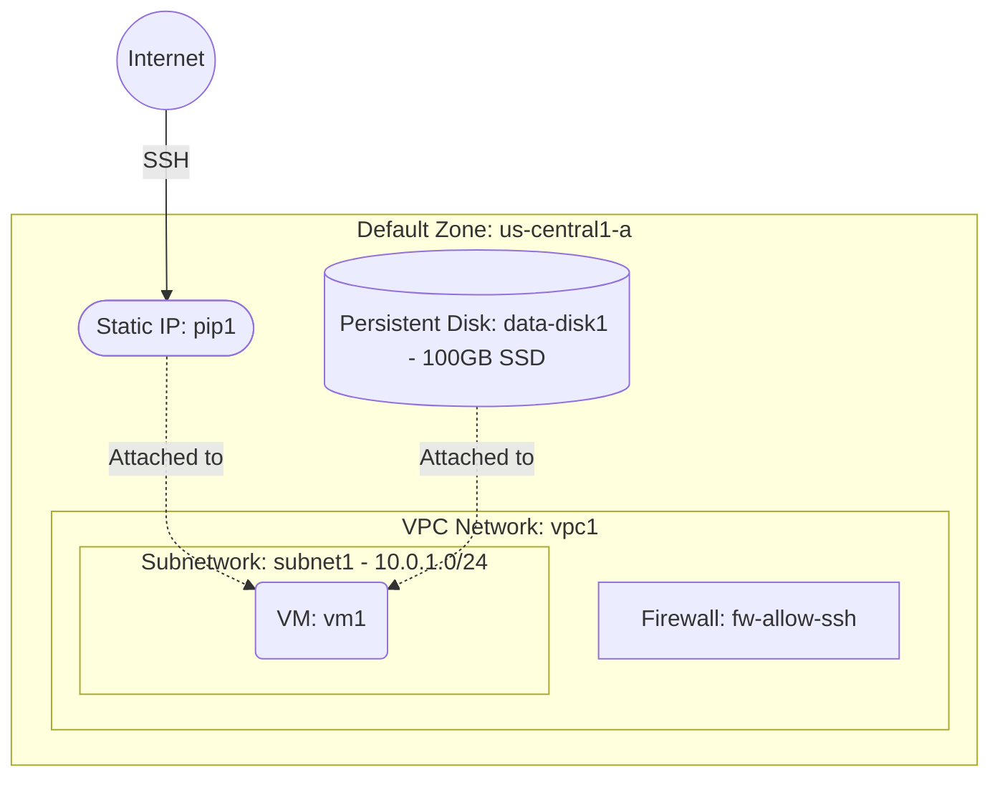

# Deploy a VM with an Additional Persistent Disk on GCP

This guide demonstrates how to use MechCloud's stateless Infrastructure-as-Code (IaC) to provision a Compute Engine VM with an additional persistent data disk for separate storage on Google Cloud Platform.

In this scenario, we deploy a VM with a boot disk and a standalone persistent disk attached for application data. Separating the data disk from the OS disk enables independent snapshots, resizing, and lifecycle management.

## Scenario Overview
**Use Case:** Running a database server or file storage system where application data is stored on a separate persistent disk, enabling independent snapshots, backups, and disk resizing without affecting the OS.
**Key MechCloud Features Highlighted:**
- Zonal defaults injection (`zone: us-central1-a`)
- Hierarchical resource nesting (VPC $\rightarrow$ Subnetwork & Firewall)
- Cross-resource referencing (`ref:`)
- Standalone persistent disk attached to a VM

### Architecture Diagram



***

## Step 1: Setting up Networking

We create a custom VPC with a subnetwork and a firewall rule allowing SSH from your IP.

```yaml
defaults:
  zone: us-central1-a

resources:
  - type: compute.v1.network
    name: vpc1
    props:
      auto_create_subnetworks: false
    resources:
      - type: compute.v1.subnetwork
        name: subnet1
        props:
          ip_cidr_range: "10.0.1.0/24"

      - type: compute.v1.firewall
        name: fw-allow-ssh
        props:
          allowed:
            - ip_protocol: tcp
              ports:
                - "22"
          source_ranges:
            - "{{CURRENT_IP}}/32"
```

## Step 2: Creating the Persistent Data Disk

We provision a standalone SSD persistent disk that will be attached to the VM as a secondary data volume.

```yaml
# ... (Continuing at the root resources level) ...
  - type: compute.v1.disk
    name: data-disk1
    props:
      size_gb: 100
      type: diskTypes/pd-ssd
```

## Step 3: Creating the Static IP and VM with Data Disk

We allocate a static IP and deploy the VM with both a boot disk and the additional data disk attached.

```yaml
# ... (Continuing at the root resources level) ...
  - type: compute.v1.address
    name: pip1
    props:
      address_type: EXTERNAL

  - type: compute.v1.instance
    name: vm1
    props:
      machine_type: machineTypes/e2-micro
      disks:
        - boot: true
          auto_delete: true
          initialize_params:
            disk_size_gb: 30
            disk_type: diskTypes/pd-standard
            source_image: projects/ubuntu-os-cloud/global/images/family/ubuntu-2404-lts
        - boot: false
          auto_delete: false
          source: "ref:data-disk1"
      network_interfaces:
        - subnetwork: "ref:vpc1/subnet1"
          access_configs:
            - type: ONE_TO_ONE_NAT
              name: External NAT
              nat_ip: "ref:pip1"
```

### Complete Unified Template

For your convenience, here is the complete, unified MechCloud template combining all steps:

```yaml
defaults:
  zone: us-central1-a

resources:
  - type: compute.v1.network
    name: vpc1
    props:
      auto_create_subnetworks: false
    resources:
      - type: compute.v1.subnetwork
        name: subnet1
        props:
          ip_cidr_range: "10.0.1.0/24"

      - type: compute.v1.firewall
        name: fw-allow-ssh
        props:
          allowed:
            - ip_protocol: tcp
              ports:
                - "22"
          source_ranges:
            - "{{CURRENT_IP}}/32"

  - type: compute.v1.disk
    name: data-disk1
    props:
      size_gb: 100
      type: diskTypes/pd-ssd

  - type: compute.v1.address
    name: pip1
    props:
      address_type: EXTERNAL

  - type: compute.v1.instance
    name: vm1
    props:
      machine_type: machineTypes/e2-micro
      disks:
        - boot: true
          auto_delete: true
          initialize_params:
            disk_size_gb: 30
            disk_type: diskTypes/pd-standard
            source_image: projects/ubuntu-os-cloud/global/images/family/ubuntu-2404-lts
        - boot: false
          auto_delete: false
          source: "ref:data-disk1"
      network_interfaces:
        - subnetwork: "ref:vpc1/subnet1"
          access_configs:
            - type: ONE_TO_ONE_NAT
              name: External NAT
              nat_ip: "ref:pip1"
```
