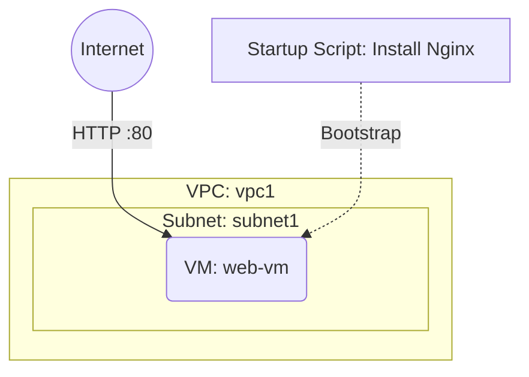

# Deploy a VM with Startup Script on GCP

This guide demonstrates how to use MechCloud's stateless IaC to provision a Compute Engine VM with a startup script that automatically installs and configures software at boot time.

## Scenario Overview
**Use Case:** Automating VM provisioning with custom software installation (Nginx, Docker, agents) — the startup script runs post-boot, replacing manual SSH configuration steps.
**Key MechCloud Features Highlighted:**
- Hierarchical resource nesting (VPC → Subnet → VM)
- Cross-resource referencing (`ref:`)
- Startup script inline

### Architecture Diagram



***

### Complete Unified Template

```yaml
resources:
  - type: gcp_compute_network
    name: vpc1
    props:
      auto_create_subnetworks: false
    resources:
      - type: gcp_compute_subnetwork
        name: subnet1
        props:
          ip_cidr_range: "10.0.1.0/24"
          region: "{{CURRENT_REGION}}"
      - type: gcp_compute_firewall
        name: fw-http
        props:
          direction: INGRESS
          allow:
            - protocol: tcp
              ports:
                - "80"
          source_ranges:
            - "0.0.0.0/0"
          target_tags:
            - web-server
      - type: gcp_compute_firewall
        name: fw-ssh
        props:
          direction: INGRESS
          allow:
            - protocol: tcp
              ports:
                - "22"
          source_ranges:
            - "{{CURRENT_IP}}/32"

  - type: gcp_compute_address
    name: web-ip
    props:
      region: "{{CURRENT_REGION}}"

  - type: gcp_compute_instance
    name: web-vm
    props:
      machine_type: "e2-standard-2"
      zone: "{{CURRENT_REGION}}-a"
      tags:
        - web-server
      boot_disk:
        initialize_params:
          image: "ubuntu-os-cloud/ubuntu-2404-lts-amd64"
          size: 20
      network_interface:
        - subnetwork: "ref:vpc1/subnet1"
          access_config:
            - nat_ip: "ref:web-ip"
      metadata:
        startup-script: |
          #!/bin/bash
          apt-get update
          apt-get install -y nginx
          systemctl enable nginx
          systemctl start nginx
          echo "<h1>Hello from MechCloud!</h1>" > /var/www/html/index.html
```
