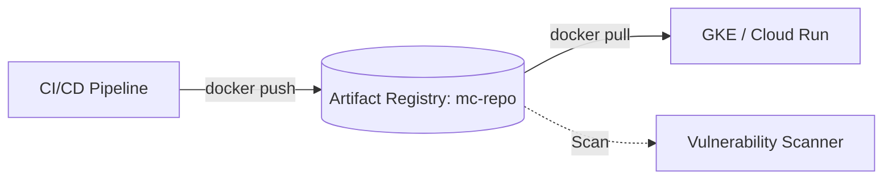

# Deploy Artifact Registry for Container Images on GCP

This guide demonstrates how to use MechCloud's stateless IaC to provision an Artifact Registry repository for storing and managing container images, language packages, and OS packages.

## Scenario Overview
**Use Case:** A private container registry for storing Docker images with vulnerability scanning, IAM-based access control, and regional replication — essential for any containerized CI/CD pipeline on GCP, replacing the legacy Container Registry.
**Key MechCloud Features Highlighted:**
- Cross-resource referencing (`ref:`)
- Repository configuration as clean YAML
- IAM policy binding for access control

### Architecture Diagram



***

### Complete Unified Template

```yaml
resources:
  - type: gcp_artifact_registry_repository
    name: docker-repo
    props:
      repository_id: "mc-docker-repo"
      location: "{{CURRENT_REGION}}"
      format: DOCKER
      description: "Docker container images"
      cleanup_policies:
        - id: delete-old-images
          action: DELETE
          condition:
            older_than: "2592000s"
            tag_state: UNTAGGED

  - type: gcp_artifact_registry_repository
    name: python-repo
    props:
      repository_id: "mc-python-repo"
      location: "{{CURRENT_REGION}}"
      format: PYTHON
      description: "Python packages"

  - type: gcp_service_account
    name: ci-sa
    props:
      account_id: "mc-ci-registry-sa"
      display_name: "CI/CD Registry Service Account"

  - type: gcp_artifact_registry_repository_iam_member
    name: ci-writer
    props:
      repository: "ref:docker-repo"
      location: "{{CURRENT_REGION}}"
      role: roles/artifactregistry.writer
      member: "serviceAccount:ref:ci-sa.email"

  - type: gcp_artifact_registry_repository_iam_member
    name: ci-reader
    props:
      repository: "ref:docker-repo"
      location: "{{CURRENT_REGION}}"
      role: roles/artifactregistry.reader
      member: "serviceAccount:ref:ci-sa.email"
```
