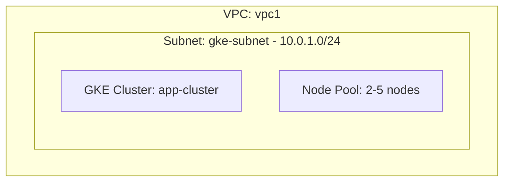

# Deploy a GKE Cluster with Node Pool on GCP

This guide demonstrates how to use MechCloud's stateless IaC to provision a Google Kubernetes Engine (GKE) cluster with a managed node pool for container orchestration.

## Scenario Overview
**Use Case:** A production-grade Kubernetes cluster for running containerized microservices with automatic node scaling, integrated with GCP networking and IAM — ideal for teams adopting Kubernetes without managing the control plane.
**Key MechCloud Features Highlighted:**
- Hierarchical resource nesting (VPC → Subnet → GKE)
- Cross-resource referencing (`ref:`)
- Complex cluster configuration as clean YAML

### Architecture Diagram



***

### Complete Unified Template

```yaml
resources:
  - type: gcp_compute_network
    name: vpc1
    props:
      auto_create_subnetworks: false
    resources:
      - type: gcp_compute_subnetwork
        name: gke-subnet
        props:
          ip_cidr_range: "10.0.1.0/24"
          region: "{{CURRENT_REGION}}"
          secondary_ip_ranges:
            - range_name: pods
              ip_cidr_range: "10.10.0.0/16"
            - range_name: services
              ip_cidr_range: "10.20.0.0/20"

  - type: gcp_container_cluster
    name: app-cluster
    props:
      location: "{{CURRENT_REGION}}"
      network: "ref:vpc1"
      subnetwork: "ref:vpc1/gke-subnet"
      networking_mode: VPC_NATIVE
      ip_allocation_policy:
        cluster_secondary_range_name: pods
        services_secondary_range_name: services
      initial_node_count: 1
      remove_default_node_pool: true
      private_cluster_config:
        enable_private_nodes: true
        enable_private_endpoint: false
        master_ipv4_cidr_block: "172.16.0.0/28"
      master_auth:
        client_certificate_config:
          issue_client_certificate: false

  - type: gcp_container_node_pool
    name: app-nodes
    props:
      cluster: "ref:app-cluster"
      location: "{{CURRENT_REGION}}"
      node_count: 2
      autoscaling:
        min_node_count: 2
        max_node_count: 5
      node_config:
        machine_type: "e2-standard-4"
        disk_size_gb: 50
        disk_type: pd-standard
        oauth_scopes:
          - "https://www.googleapis.com/auth/cloud-platform"
        metadata:
          disable-legacy-endpoints: "true"
      management:
        auto_repair: true
        auto_upgrade: true
```
