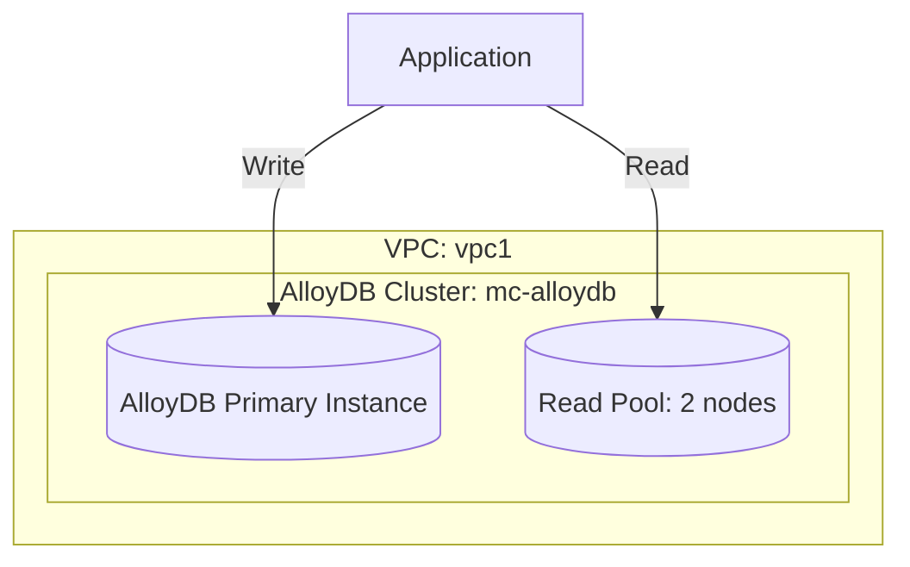

# Deploy AlloyDB Cluster for PostgreSQL-Compatible Analytics on GCP

This guide demonstrates how to use MechCloud's stateless IaC to provision an AlloyDB cluster — Google's fully managed, PostgreSQL-compatible database designed for demanding transactional and analytical workloads.

## Scenario Overview
**Use Case:** A high-performance PostgreSQL-compatible database that is up to 100x faster than standard PostgreSQL for analytical queries and 4x faster for transactional workloads — ideal for enterprise applications requiring both OLTP and OLAP capabilities in a single database.
**Key MechCloud Features Highlighted:**
- Cross-resource referencing (`ref:`)
- Cluster, primary instance, and read pool configuration
- VPC-native private connectivity

### Architecture Diagram



***

### Complete Unified Template

```yaml
resources:
  - type: gcp_compute_network
    name: vpc1
    props:
      auto_create_subnetworks: false
    resources:
      - type: gcp_compute_subnetwork
        name: db-subnet
        props:
          ip_cidr_range: "10.0.1.0/24"
          region: "{{CURRENT_REGION}}"

  - type: gcp_compute_global_address
    name: private-ip-range
    props:
      purpose: VPC_PEERING
      address_type: INTERNAL
      prefix_length: 16
      network: "ref:vpc1"

  - type: gcp_service_networking_connection
    name: private-connection
    props:
      network: "ref:vpc1"
      service: "servicenetworking.googleapis.com"
      reserved_peering_ranges:
        - "ref:private-ip-range"

  - type: gcp_alloydb_cluster
    name: mc-alloydb
    props:
      cluster_id: "mc-alloydb-cluster"
      location: "{{CURRENT_REGION}}"
      network_config:
        network: "ref:vpc1"
      automated_backup_policy:
        enabled: true
        backup_window: "02:00"
        weekly_schedule:
          days_of_week:
            - MONDAY
            - WEDNESDAY
            - FRIDAY
        quantity_based_retention:
          count: 7

  - type: gcp_alloydb_instance
    name: primary-instance
    props:
      cluster: "ref:mc-alloydb"
      instance_id: "mc-alloydb-primary"
      instance_type: PRIMARY
      machine_config:
        cpu_count: 4

  - type: gcp_alloydb_instance
    name: read-pool
    props:
      cluster: "ref:mc-alloydb"
      instance_id: "mc-alloydb-reader"
      instance_type: READ_POOL
      read_pool_config:
        node_count: 2
      machine_config:
        cpu_count: 4
```
