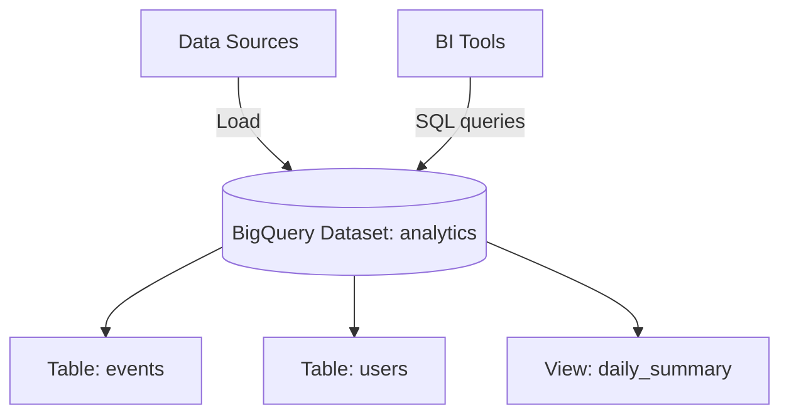

# Deploy BigQuery Dataset with Tables on GCP

This guide demonstrates how to use MechCloud's stateless IaC to provision a BigQuery dataset with tables and views for data warehousing and analytics.

## Scenario Overview
**Use Case:** A serverless data warehouse for running SQL analytics over petabytes of data — ideal for business intelligence, data lake analytics, and real-time dashboards with pay-per-query pricing.
**Key MechCloud Features Highlighted:**
- Cross-resource referencing (`ref:`)
- Table schemas as clean YAML
- Dataset-level access controls

### Architecture Diagram



***

### Complete Unified Template

```yaml
resources:
  - type: gcp_bigquery_dataset
    name: analytics
    props:
      dataset_id: "mc_analytics"
      location: "{{CURRENT_REGION}}"
      description: "Analytics data warehouse"
      default_table_expiration_ms: 0
      default_partition_expiration_ms: 0
      delete_contents_on_destroy: true
      access:
        - role: OWNER
          user_by_email: "admin@example.com"
        - role: READER
          group_by_email: "analysts@example.com"

  - type: gcp_bigquery_table
    name: events
    props:
      dataset_id: "ref:analytics"
      table_id: events
      deletion_protection: false
      time_partitioning:
        type: DAY
        field: event_timestamp
        expiration_ms: 7776000000
      clustering:
        - event_type
        - user_id
      schema: |
        [
          {"name": "event_id", "type": "STRING", "mode": "REQUIRED"},
          {"name": "event_type", "type": "STRING", "mode": "REQUIRED"},
          {"name": "user_id", "type": "STRING", "mode": "NULLABLE"},
          {"name": "event_timestamp", "type": "TIMESTAMP", "mode": "REQUIRED"},
          {"name": "properties", "type": "JSON", "mode": "NULLABLE"},
          {"name": "session_id", "type": "STRING", "mode": "NULLABLE"}
        ]

  - type: gcp_bigquery_table
    name: users
    props:
      dataset_id: "ref:analytics"
      table_id: users
      deletion_protection: false
      schema: |
        [
          {"name": "user_id", "type": "STRING", "mode": "REQUIRED"},
          {"name": "email", "type": "STRING", "mode": "REQUIRED"},
          {"name": "name", "type": "STRING", "mode": "NULLABLE"},
          {"name": "created_at", "type": "TIMESTAMP", "mode": "REQUIRED"},
          {"name": "country", "type": "STRING", "mode": "NULLABLE"},
          {"name": "plan", "type": "STRING", "mode": "NULLABLE"}
        ]

  - type: gcp_bigquery_table
    name: daily-summary
    props:
      dataset_id: "ref:analytics"
      table_id: daily_summary
      deletion_protection: false
      view:
        query: |
          SELECT
            DATE(event_timestamp) as event_date,
            event_type,
            COUNT(*) as event_count,
            COUNT(DISTINCT user_id) as unique_users
          FROM `mc_analytics.events`
          GROUP BY 1, 2
        use_legacy_sql: false
```
