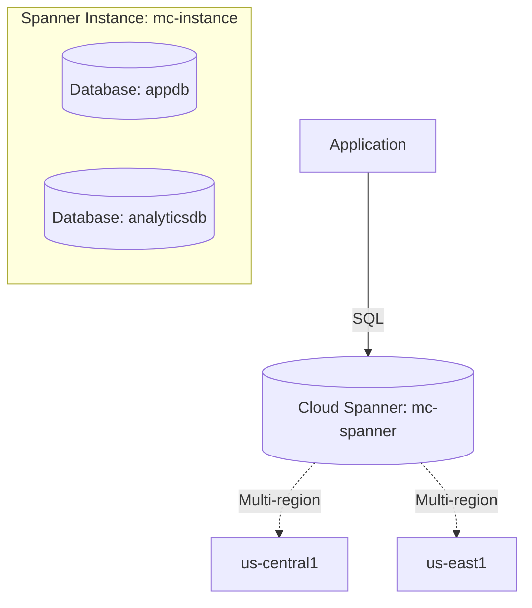

# Deploy Cloud Spanner for Globally Distributed Database on GCP

This guide demonstrates how to use MechCloud's stateless IaC to provision a Cloud Spanner instance with databases for globally distributed, strongly consistent relational workloads.

## Scenario Overview
**Use Case:** A globally distributed relational database that provides strong consistency, 99.999% availability, and automatic horizontal scaling — ideal for financial transactions, inventory management, and any workload requiring global consistency that traditional databases cannot provide.
**Key MechCloud Features Highlighted:**
- Cross-resource referencing (`ref:`)
- Instance and database configuration as clean YAML
- Schema definition inline

### Architecture Diagram



***

### Complete Unified Template

```yaml
resources:
  - type: gcp_spanner_instance
    name: mc-instance
    props:
      name: "mc-spanner-instance"
      config: "regional-{{CURRENT_REGION}}"
      display_name: "MechCloud Spanner Instance"
      num_nodes: 1

  - type: gcp_spanner_database
    name: appdb
    props:
      instance: "ref:mc-instance"
      name: appdb
      deletion_protection: false
      ddl:
        - |
          CREATE TABLE Users (
            UserId STRING(36) NOT NULL,
            Email STRING(255) NOT NULL,
            Name STRING(255),
            CreatedAt TIMESTAMP NOT NULL OPTIONS (allow_commit_timestamp=true)
          ) PRIMARY KEY (UserId)
        - |
          CREATE TABLE Orders (
            OrderId STRING(36) NOT NULL,
            UserId STRING(36) NOT NULL,
            Amount FLOAT64 NOT NULL,
            Status STRING(50) NOT NULL,
            CreatedAt TIMESTAMP NOT NULL OPTIONS (allow_commit_timestamp=true)
          ) PRIMARY KEY (OrderId),
          INTERLEAVE IN PARENT Users ON DELETE CASCADE
        - |
          CREATE INDEX OrdersByUser ON Orders(UserId)

  - type: gcp_spanner_database
    name: analyticsdb
    props:
      instance: "ref:mc-instance"
      name: analyticsdb
      deletion_protection: false
      ddl:
        - |
          CREATE TABLE Events (
            EventId STRING(36) NOT NULL,
            EventType STRING(100) NOT NULL,
            Payload JSON,
            Timestamp TIMESTAMP NOT NULL OPTIONS (allow_commit_timestamp=true)
          ) PRIMARY KEY (EventId)
```
