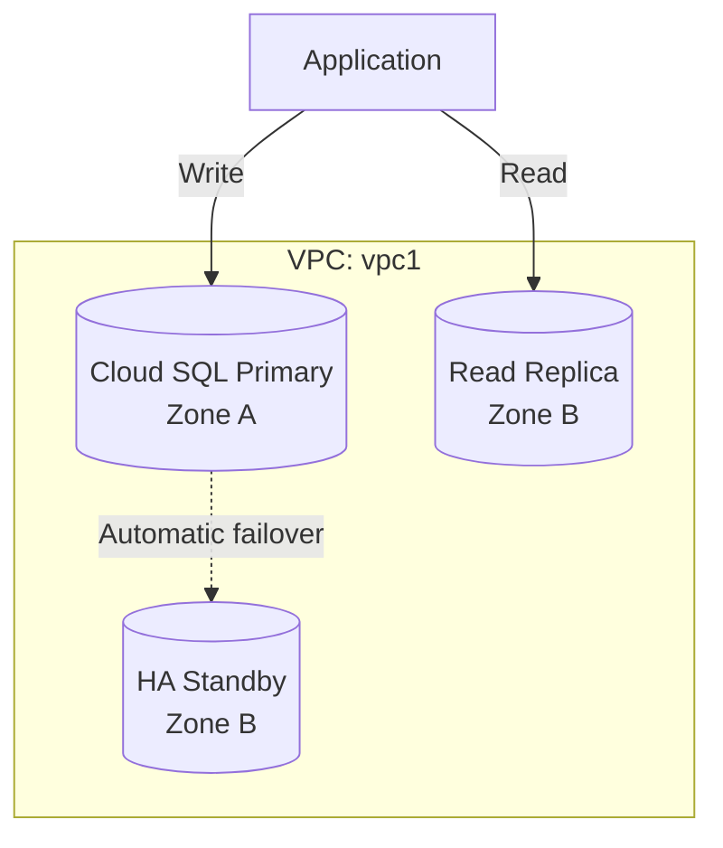

# Deploy Cloud SQL with High Availability and Read Replica on GCP

This guide demonstrates how to use MechCloud's stateless IaC to provision a Cloud SQL PostgreSQL instance with high availability failover and a read replica for production workloads.

## Scenario Overview
**Use Case:** A production-grade managed PostgreSQL database with automatic failover to a standby instance in another zone and a read replica for offloading read queries — ensuring 99.95% availability SLA and improved read performance.
**Key MechCloud Features Highlighted:**
- Cross-resource referencing (`ref:`)
- HA and replica configuration as clean YAML
- VPC-native private IP connectivity

### Architecture Diagram



***

### Complete Unified Template

```yaml
resources:
  - type: gcp_compute_network
    name: vpc1
    props:
      auto_create_subnetworks: false
    resources:
      - type: gcp_compute_subnetwork
        name: db-subnet
        props:
          ip_cidr_range: "10.0.1.0/24"
          region: "{{CURRENT_REGION}}"

  - type: gcp_compute_global_address
    name: private-ip-range
    props:
      purpose: VPC_PEERING
      address_type: INTERNAL
      prefix_length: 16
      network: "ref:vpc1"

  - type: gcp_service_networking_connection
    name: private-vpc-connection
    props:
      network: "ref:vpc1"
      service: "servicenetworking.googleapis.com"
      reserved_peering_ranges:
        - "ref:private-ip-range"

  - type: gcp_sql_database_instance
    name: primary-db
    props:
      database_version: POSTGRES_16
      region: "{{CURRENT_REGION}}"
      settings:
        tier: "db-custom-2-8192"
        availability_type: REGIONAL
        disk_size: 100
        disk_type: PD_SSD
        disk_autoresize: true
        backup_configuration:
          enabled: true
          point_in_time_recovery_enabled: true
          start_time: "02:00"
          transaction_log_retention_days: 7
          backup_retention_settings:
            retained_backups: 7
        ip_configuration:
          ipv4_enabled: false
          private_network: "ref:vpc1"
        database_flags:
          - name: log_checkpoints
            value: "on"
          - name: log_connections
            value: "on"
        maintenance_window:
          day: 7
          hour: 3
          update_track: stable
      deletion_protection: false

  - type: gcp_sql_database
    name: appdb
    props:
      instance: "ref:primary-db"
      name: appdb

  - type: gcp_sql_user
    name: app-user
    props:
      instance: "ref:primary-db"
      name: appadmin
      password: "ChangeMe123!"

  - type: gcp_sql_database_instance
    name: read-replica
    props:
      database_version: POSTGRES_16
      region: "{{CURRENT_REGION}}"
      master_instance_name: "ref:primary-db"
      replica_configuration:
        failover_target: false
      settings:
        tier: "db-custom-2-8192"
        disk_size: 100
        disk_type: PD_SSD
        disk_autoresize: true
        ip_configuration:
          ipv4_enabled: false
          private_network: "ref:vpc1"
      deletion_protection: false
```
