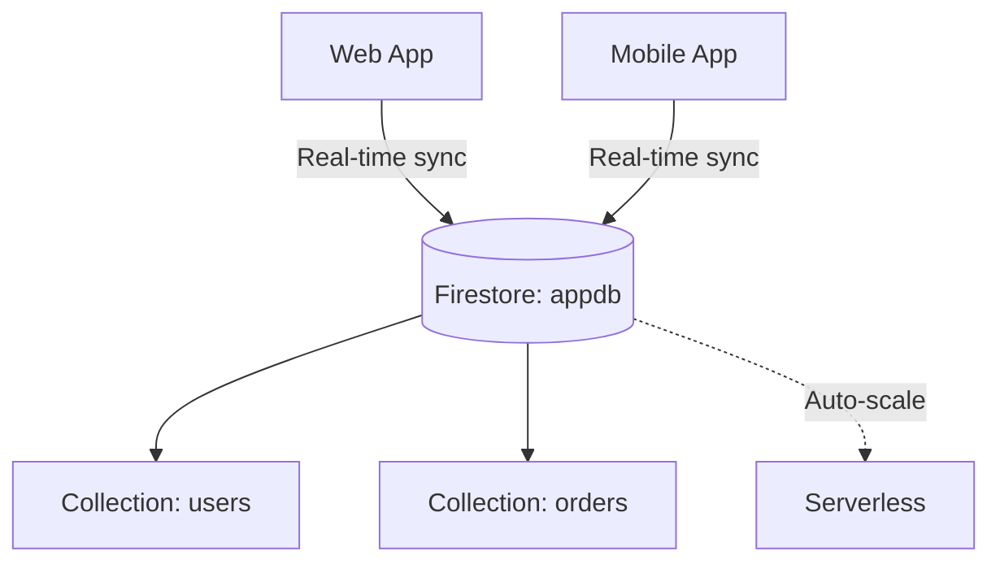

# Deploy Firestore Database with Security Rules on GCP

This guide demonstrates how to use MechCloud's stateless IaC to provision a Firestore database in Native mode for serverless document storage with real-time sync capabilities.

## Scenario Overview
**Use Case:** A serverless NoSQL document database for mobile and web applications requiring real-time data synchronization, offline support, and automatic scaling — ideal for user profiles, chat applications, and collaborative tools.
**Key MechCloud Features Highlighted:**
- Cross-resource referencing (`ref:`)
- Database and index configuration as clean YAML
- No server management needed

### Architecture Diagram



***

### Complete Unified Template

```yaml
resources:
  - type: gcp_firestore_database
    name: appdb
    props:
      name: "(default)"
      location_id: "{{CURRENT_REGION}}"
      type: FIRESTORE_NATIVE
      concurrency_mode: OPTIMISTIC
      app_engine_integration_mode: DISABLED
      delete_protection_state: DELETE_PROTECTION_DISABLED

  - type: gcp_firestore_index
    name: users-by-email
    props:
      database: "ref:appdb"
      collection: "users"
      fields:
        - field_path: email
          order: ASCENDING
        - field_path: created_at
          order: DESCENDING

  - type: gcp_firestore_index
    name: orders-by-customer
    props:
      database: "ref:appdb"
      collection: "orders"
      fields:
        - field_path: customer_id
          order: ASCENDING
        - field_path: order_date
          order: DESCENDING
        - field_path: status
          order: ASCENDING

  - type: gcp_firestore_index
    name: orders-by-status
    props:
      database: "ref:appdb"
      collection: "orders"
      fields:
        - field_path: status
          order: ASCENDING
        - field_path: order_date
          order: DESCENDING
```
