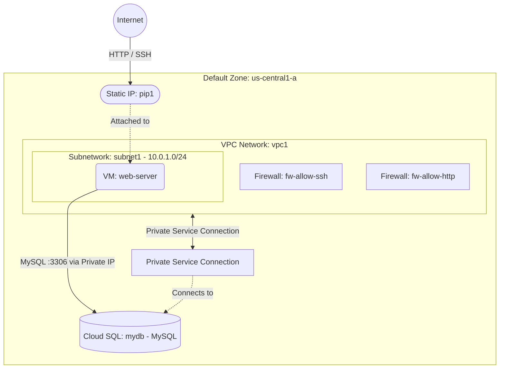

# Deploy a VM with Cloud SQL Database on GCP

This guide demonstrates how to use MechCloud's stateless Infrastructure-as-Code (IaC) to provision a Compute Engine VM connected to a Cloud SQL managed database instance on Google Cloud Platform.

In this scenario, we deploy a public-facing VM as a web application server and a Cloud SQL MySQL instance for the data layer. The Cloud SQL instance uses private IP connectivity through a VPC peering connection, ensuring database traffic never traverses the public internet.

## Scenario Overview
**Use Case:** A web application that requires a managed relational database backend, with the database accessible only via private networking and the web server publicly accessible.
**Key MechCloud Features Highlighted:**
- Zonal defaults injection (`zone: us-central1-a`)
- Hierarchical resource nesting (VPC $\rightarrow$ Subnetwork & Firewall)
- Cross-resource referencing (`ref:`)
- Cloud SQL with private IP connectivity

### Architecture Diagram



***

## Step 1: Setting up Networking

We create a VPC with a subnetwork and firewall rules for SSH and HTTP access.

```yaml
defaults:
  zone: us-central1-a

resources:
  - type: compute.v1.network
    name: vpc1
    props:
      auto_create_subnetworks: false
    resources:
      - type: compute.v1.subnetwork
        name: subnet1
        props:
          ip_cidr_range: "10.0.1.0/24"

      - type: compute.v1.firewall
        name: fw-allow-ssh
        props:
          allowed:
            - ip_protocol: tcp
              ports:
                - "22"
          source_ranges:
            - "{{CURRENT_IP}}/32"

      - type: compute.v1.firewall
        name: fw-allow-http
        props:
          allowed:
            - ip_protocol: tcp
              ports:
                - "80"
          source_ranges:
            - "0.0.0.0/0"
```

## Step 2: Setting up Private Service Connection

We allocate a private IP range and create a private service connection to allow Cloud SQL to use private IP within the VPC.

```yaml
# ... (Continuing at the root resources level) ...
  # Private IP range for Google services
  - type: compute.v1.globalAddress
    name: private-ip-range
    props:
      purpose: VPC_PEERING
      address_type: INTERNAL
      prefix_length: 16
      network: "ref:vpc1"

  # Private service connection
  - type: servicenetworking.v1.connection
    name: private-svc-connection
    props:
      network: "ref:vpc1"
      reserved_peering_ranges:
        - "ref:private-ip-range"
```

## Step 3: Creating the Cloud SQL Instance

We deploy a Cloud SQL MySQL instance configured with private IP connectivity, ensuring database traffic stays within Google's network.

```yaml
# ... (Continuing at the root resources level) ...
  - type: sqladmin.v1.instance
    name: mydb
    props:
      database_version: MYSQL_8_0
      region: us-central1
      settings:
        tier: db-f1-micro
        ip_configuration:
          ipv4_enabled: false
          private_network: "ref:vpc1"
        backup_configuration:
          enabled: true
          start_time: "03:00"
        storage_auto_resize: true
        disk_size: 20
        disk_type: PD_SSD
      root_password: P@ssw0rd1234!
```

## Step 4: Provisioning the Web Server

We deploy a VM with a static external IP that can connect to Cloud SQL via private networking.

```yaml
# ... (Continuing at the root resources level) ...
  - type: compute.v1.address
    name: pip1
    props:
      address_type: EXTERNAL

  - type: compute.v1.instance
    name: web-server
    props:
      machine_type: machineTypes/e2-micro
      disks:
        - boot: true
          auto_delete: true
          initialize_params:
            disk_size_gb: 30
            disk_type: diskTypes/pd-standard
            source_image: projects/ubuntu-os-cloud/global/images/family/ubuntu-2404-lts
      network_interfaces:
        - subnetwork: "ref:vpc1/subnet1"
          access_configs:
            - type: ONE_TO_ONE_NAT
              name: External NAT
              nat_ip: "ref:pip1"
```

### Complete Unified Template

For your convenience, here is the complete, unified MechCloud template combining all steps:

```yaml
defaults:
  zone: us-central1-a

resources:
  - type: compute.v1.network
    name: vpc1
    props:
      auto_create_subnetworks: false
    resources:
      - type: compute.v1.subnetwork
        name: subnet1
        props:
          ip_cidr_range: "10.0.1.0/24"

      - type: compute.v1.firewall
        name: fw-allow-ssh
        props:
          allowed:
            - ip_protocol: tcp
              ports:
                - "22"
          source_ranges:
            - "{{CURRENT_IP}}/32"

      - type: compute.v1.firewall
        name: fw-allow-http
        props:
          allowed:
            - ip_protocol: tcp
              ports:
                - "80"
          source_ranges:
            - "0.0.0.0/0"

  - type: compute.v1.globalAddress
    name: private-ip-range
    props:
      purpose: VPC_PEERING
      address_type: INTERNAL
      prefix_length: 16
      network: "ref:vpc1"

  - type: servicenetworking.v1.connection
    name: private-svc-connection
    props:
      network: "ref:vpc1"
      reserved_peering_ranges:
        - "ref:private-ip-range"

  - type: sqladmin.v1.instance
    name: mydb
    props:
      database_version: MYSQL_8_0
      region: us-central1
      settings:
        tier: db-f1-micro
        ip_configuration:
          ipv4_enabled: false
          private_network: "ref:vpc1"
        backup_configuration:
          enabled: true
          start_time: "03:00"
        storage_auto_resize: true
        disk_size: 20
        disk_type: PD_SSD
      root_password: P@ssw0rd1234!

  - type: compute.v1.address
    name: pip1
    props:
      address_type: EXTERNAL

  - type: compute.v1.instance
    name: web-server
    props:
      machine_type: machineTypes/e2-micro
      disks:
        - boot: true
          auto_delete: true
          initialize_params:
            disk_size_gb: 30
            disk_type: diskTypes/pd-standard
            source_image: projects/ubuntu-os-cloud/global/images/family/ubuntu-2404-lts
      network_interfaces:
        - subnetwork: "ref:vpc1/subnet1"
          access_configs:
            - type: ONE_TO_ONE_NAT
              name: External NAT
              nat_ip: "ref:pip1"
```
