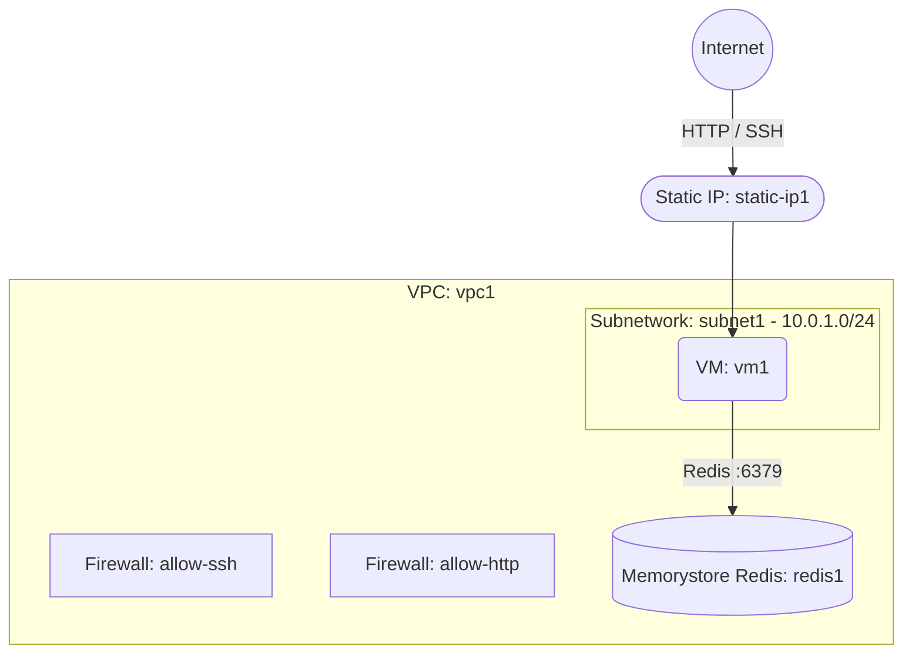

# Deploy a VM with Memorystore for Redis on GCP

This guide demonstrates how to use MechCloud's stateless Infrastructure-as-Code (IaC) to provision a Compute Engine VM with a Memorystore for Redis instance for in-memory caching on Google Cloud Platform.

In this scenario, we deploy a public-facing VM as the application server and a Memorystore for Redis instance for low-latency data caching. The Redis instance is accessible only from within the VPC via private networking.

## Scenario Overview
**Use Case:** A web application that requires sub-millisecond data access for session caching, real-time analytics, or frequently accessed database results using a fully managed Redis service.
**Key MechCloud Features Highlighted:**
- Hierarchical resource nesting (VPC → Subnetwork & Firewall)
- Cross-resource referencing (`ref:`)
- Memorystore for Redis provisioning with VPC connectivity

### Architecture Diagram



***

### Complete Unified Template

```yaml
defaults:
  zone: us-central1-a

resources:
  - type: google_compute_network
    name: vpc1
    props:
      auto_create_subnetworks: false
    resources:
      - type: google_compute_subnetwork
        name: subnet1
        props:
          ip_cidr_range: "10.0.1.0/24"
          region: us-central1

      - type: google_compute_firewall
        name: allow-ssh
        props:
          direction: INGRESS
          priority: 1000
          source_ranges:
            - "{{CURRENT_IP}}/32"
          allow:
            - protocol: tcp
              ports:
                - "22"

      - type: google_compute_firewall
        name: allow-http
        props:
          direction: INGRESS
          priority: 1000
          source_ranges:
            - "0.0.0.0/0"
          allow:
            - protocol: tcp
              ports:
                - "80"

  - type: google_compute_address
    name: static-ip1
    props:
      address_type: EXTERNAL
      region: us-central1

  - type: google_compute_instance
    name: vm1
    props:
      machine_type: e2-medium
      boot_disk:
        initialize_params:
          image: "{{Image|arm64_ubuntu_24_04}}"
          size: 20
      network_interfaces:
        - subnetwork: "ref:vpc1/subnet1"
          access_configs:
            - nat_ip: "ref:static-ip1"

  - type: google_redis_instance
    name: redis1
    props:
      tier: BASIC
      memory_size_gb: 1
      region: us-central1
      authorized_network: "ref:vpc1"
      redis_version: REDIS_7_0
      display_name: "mc-redis"
```
