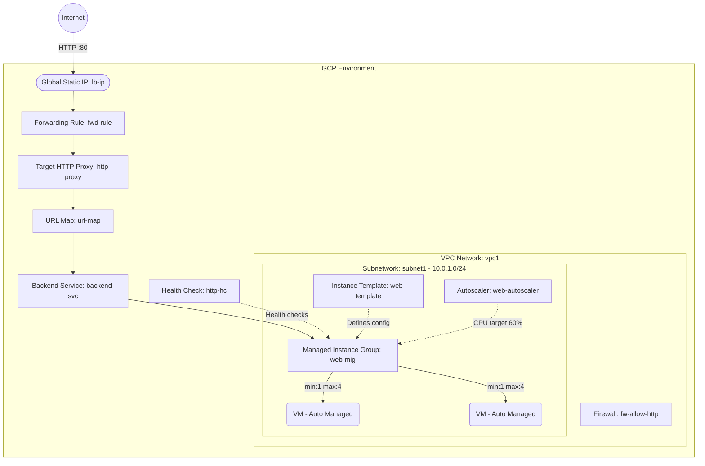

# Deploy a Managed Instance Group with Autoscaler on GCP

This guide demonstrates how to use MechCloud's stateless Infrastructure-as-Code (IaC) to provision a Managed Instance Group (MIG) with an Autoscaler for automatic horizontal scaling on Google Cloud Platform.

In this scenario, we deploy a MIG that automatically manages VM instances based on CPU utilization. The MIG uses an Instance Template to define the VM configuration and scales between 1 and 4 instances. An HTTP(S) Load Balancer distributes traffic across the instances.

## Scenario Overview
**Use Case:** A production web application that needs to automatically scale out during traffic spikes and scale in during low demand, ensuring high availability and cost optimization.
**Key MechCloud Features Highlighted:**
- Zonal defaults injection (`zone: us-central1-a`)
- Hierarchical resource nesting (VPC $\rightarrow$ Subnetwork & Firewall)
- Cross-resource referencing (`ref:`)
- Managed Instance Group with Instance Template and Autoscaler

### Architecture Diagram



***

## Step 1: Setting up Networking and Security

We create a VPC with a subnetwork and firewall rules for HTTP traffic and Google health check probes.

```yaml
defaults:
  zone: us-central1-a

resources:
  - type: compute.v1.network
    name: vpc1
    props:
      auto_create_subnetworks: false
    resources:
      - type: compute.v1.subnetwork
        name: subnet1
        props:
          ip_cidr_range: "10.0.1.0/24"

      - type: compute.v1.firewall
        name: fw-allow-http
        props:
          allowed:
            - ip_protocol: tcp
              ports:
                - "80"
          source_ranges:
            - "0.0.0.0/0"

      - type: compute.v1.firewall
        name: fw-allow-health-check
        props:
          allowed:
            - ip_protocol: tcp
              ports:
                - "80"
          source_ranges:
            - "130.211.0.0/22"
            - "35.191.0.0/16"
```

## Step 2: Creating the Instance Template

The Instance Template defines the VM configuration that the MIG will use when creating and replacing instances.

```yaml
# ... (Continuing at the root resources level) ...
  - type: compute.v1.instanceTemplate
    name: web-template
    props:
      properties:
        machine_type: e2-micro
        disks:
          - boot: true
            auto_delete: true
            initialize_params:
              disk_size_gb: 30
              disk_type: pd-standard
              source_image: projects/ubuntu-os-cloud/global/images/family/ubuntu-2404-lts
        network_interfaces:
          - subnetwork: "ref:vpc1/subnet1"
```

## Step 3: Creating the MIG, Autoscaler, and Load Balancer

We provision the MIG with named ports, an autoscaler targeting 60% CPU utilization, and the full HTTP(S) Load Balancer stack.

```yaml
# ... (Continuing at the root resources level) ...
  # Managed Instance Group
  - type: compute.v1.instanceGroupManager
    name: web-mig
    props:
      base_instance_name: web-vm
      instance_template: "ref:web-template"
      target_size: 2
      named_ports:
        - name: http
          port: 80

  # Autoscaler
  - type: compute.v1.autoscaler
    name: web-autoscaler
    props:
      target: "ref:web-mig"
      autoscaling_policy:
        min_num_replicas: 1
        max_num_replicas: 4
        cpu_utilization:
          utilization_target: 0.6
        cool_down_period_sec: 60

  # Health Check
  - type: compute.v1.httpHealthCheck
    name: http-hc
    props:
      port: 80
      request_path: "/"
      check_interval_sec: 10
      timeout_sec: 5
      healthy_threshold: 2
      unhealthy_threshold: 3

  # Backend Service
  - type: compute.v1.backendService
    name: backend-svc
    props:
      protocol: HTTP
      port_name: http
      health_checks:
        - "ref:http-hc"
      backends:
        - group: "ref:web-mig"
          balancing_mode: UTILIZATION
          max_utilization: 0.8

  # URL Map
  - type: compute.v1.urlMap
    name: url-map
    props:
      default_service: "ref:backend-svc"

  # Target HTTP Proxy
  - type: compute.v1.targetHttpProxy
    name: http-proxy
    props:
      url_map: "ref:url-map"

  # Global Static IP
  - type: compute.v1.globalAddress
    name: lb-ip
    props:
      ip_version: IPV4

  # Forwarding Rule
  - type: compute.v1.globalForwardingRule
    name: fwd-rule
    props:
      ip_address: "ref:lb-ip"
      ip_protocol: TCP
      port_range: "80"
      target: "ref:http-proxy"
```

### Complete Unified Template

For your convenience, here is the complete, unified MechCloud template combining all steps:

```yaml
defaults:
  zone: us-central1-a

resources:
  - type: compute.v1.network
    name: vpc1
    props:
      auto_create_subnetworks: false
    resources:
      - type: compute.v1.subnetwork
        name: subnet1
        props:
          ip_cidr_range: "10.0.1.0/24"

      - type: compute.v1.firewall
        name: fw-allow-http
        props:
          allowed:
            - ip_protocol: tcp
              ports:
                - "80"
          source_ranges:
            - "0.0.0.0/0"

      - type: compute.v1.firewall
        name: fw-allow-health-check
        props:
          allowed:
            - ip_protocol: tcp
              ports:
                - "80"
          source_ranges:
            - "130.211.0.0/22"
            - "35.191.0.0/16"

  - type: compute.v1.instanceTemplate
    name: web-template
    props:
      properties:
        machine_type: e2-micro
        disks:
          - boot: true
            auto_delete: true
            initialize_params:
              disk_size_gb: 30
              disk_type: pd-standard
              source_image: projects/ubuntu-os-cloud/global/images/family/ubuntu-2404-lts
        network_interfaces:
          - subnetwork: "ref:vpc1/subnet1"

  - type: compute.v1.instanceGroupManager
    name: web-mig
    props:
      base_instance_name: web-vm
      instance_template: "ref:web-template"
      target_size: 2
      named_ports:
        - name: http
          port: 80

  - type: compute.v1.autoscaler
    name: web-autoscaler
    props:
      target: "ref:web-mig"
      autoscaling_policy:
        min_num_replicas: 1
        max_num_replicas: 4
        cpu_utilization:
          utilization_target: 0.6
        cool_down_period_sec: 60

  - type: compute.v1.httpHealthCheck
    name: http-hc
    props:
      port: 80
      request_path: "/"
      check_interval_sec: 10
      timeout_sec: 5
      healthy_threshold: 2
      unhealthy_threshold: 3

  - type: compute.v1.backendService
    name: backend-svc
    props:
      protocol: HTTP
      port_name: http
      health_checks:
        - "ref:http-hc"
      backends:
        - group: "ref:web-mig"
          balancing_mode: UTILIZATION
          max_utilization: 0.8

  - type: compute.v1.urlMap
    name: url-map
    props:
      default_service: "ref:backend-svc"

  - type: compute.v1.targetHttpProxy
    name: http-proxy
    props:
      url_map: "ref:url-map"

  - type: compute.v1.globalAddress
    name: lb-ip
    props:
      ip_version: IPV4

  - type: compute.v1.globalForwardingRule
    name: fwd-rule
    props:
      ip_address: "ref:lb-ip"
      ip_protocol: TCP
      port_range: "80"
      target: "ref:http-proxy"
```
