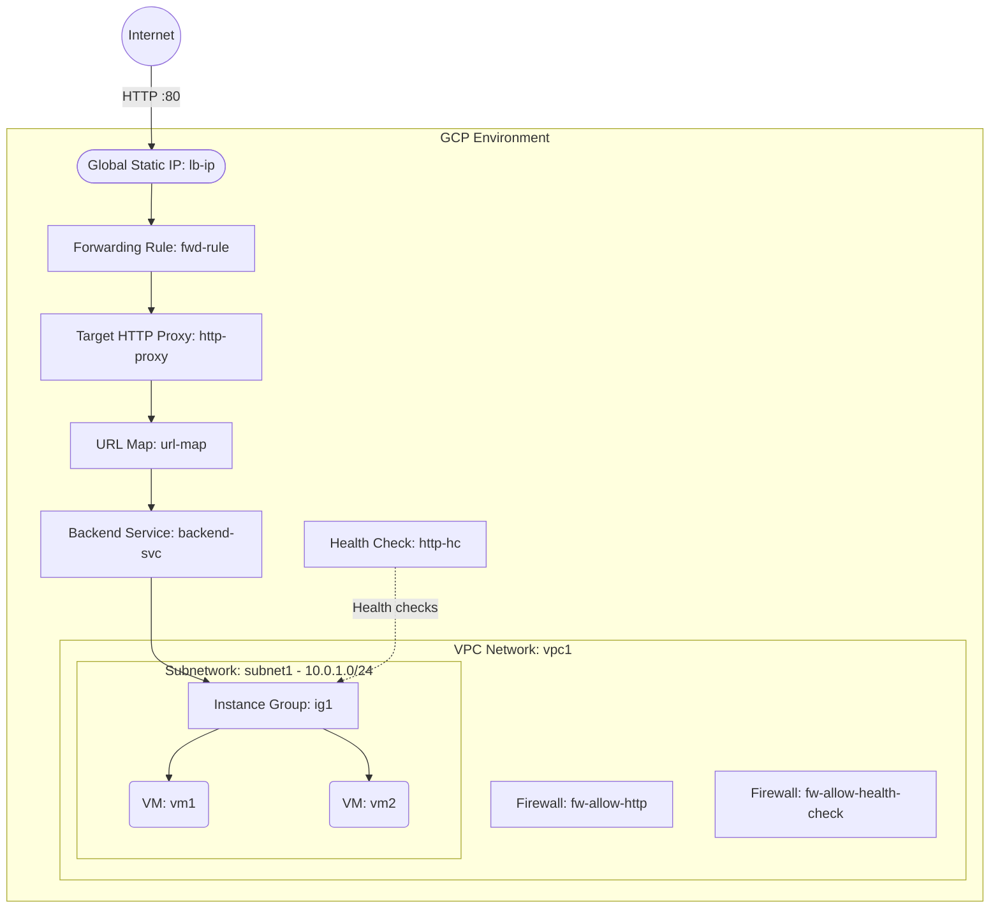

# Deploy VMs behind an HTTP(S) Load Balancer on GCP

This guide demonstrates how to use MechCloud's stateless Infrastructure-as-Code (IaC) to provision Compute Engine VMs behind a Google Cloud HTTP(S) Load Balancer for global traffic distribution.

In this scenario, we deploy two VMs in a managed instance group behind a global HTTP(S) Load Balancer. The Load Balancer distributes incoming HTTP traffic across the VMs using health checks and a backend service. A static external IP provides a stable entry point.

## Scenario Overview
**Use Case:** Hosting a highly available web application with global load balancing, automatic health checking, and traffic distribution across multiple VM instances.
**Key MechCloud Features Highlighted:**
- Zonal defaults injection (`zone: us-central1-a`)
- Hierarchical resource nesting (VPC $\rightarrow$ Subnetwork & Firewall)
- Cross-resource referencing (`ref:`)
- Complex GCP load balancing stack

### Architecture Diagram



***

## Step 1: Setting up Networking and Security

We create a VPC with a subnet and firewall rules allowing HTTP traffic from the internet and health check probes from Google's health check IP ranges.

```yaml
defaults:
  zone: us-central1-a

resources:
  - type: compute.v1.network
    name: vpc1
    props:
      auto_create_subnetworks: false
    resources:
      - type: compute.v1.subnetwork
        name: subnet1
        props:
          ip_cidr_range: "10.0.1.0/24"

      # Allow HTTP from internet
      - type: compute.v1.firewall
        name: fw-allow-http
        props:
          allowed:
            - ip_protocol: tcp
              ports:
                - "80"
          source_ranges:
            - "0.0.0.0/0"

      # Allow health check probes from Google ranges
      - type: compute.v1.firewall
        name: fw-allow-health-check
        props:
          allowed:
            - ip_protocol: tcp
              ports:
                - "80"
          source_ranges:
            - "130.211.0.0/22"
            - "35.191.0.0/16"
```

## Step 2: Creating the VMs

We deploy two VM instances that will serve as the backend for the load balancer.

```yaml
# ... (Continuing at the root resources level) ...
  - type: compute.v1.instance
    name: vm1
    props:
      machine_type: machineTypes/e2-micro
      disks:
        - boot: true
          auto_delete: true
          initialize_params:
            disk_size_gb: 30
            disk_type: diskTypes/pd-standard
            source_image: projects/ubuntu-os-cloud/global/images/family/ubuntu-2404-lts
      network_interfaces:
        - subnetwork: "ref:vpc1/subnet1"

  - type: compute.v1.instance
    name: vm2
    props:
      machine_type: machineTypes/e2-micro
      disks:
        - boot: true
          auto_delete: true
          initialize_params:
            disk_size_gb: 30
            disk_type: diskTypes/pd-standard
            source_image: projects/ubuntu-os-cloud/global/images/family/ubuntu-2404-lts
      network_interfaces:
        - subnetwork: "ref:vpc1/subnet1"
```

## Step 3: Creating the Load Balancer Stack

We create the full GCP HTTP(S) Load Balancer stack: health check, backend service, URL map, target proxy, global IP, and forwarding rule.

```yaml
# ... (Continuing at the root resources level) ...
  # Health Check
  - type: compute.v1.httpHealthCheck
    name: http-hc
    props:
      port: 80
      request_path: "/"
      check_interval_sec: 10
      timeout_sec: 5
      healthy_threshold: 2
      unhealthy_threshold: 3

  # Instance Group
  - type: compute.v1.instanceGroup
    name: ig1
    props:
      named_ports:
        - name: http
          port: 80
      instances:
        - "ref:vm1"
        - "ref:vm2"

  # Backend Service
  - type: compute.v1.backendService
    name: backend-svc
    props:
      protocol: HTTP
      port_name: http
      health_checks:
        - "ref:http-hc"
      backends:
        - group: "ref:ig1"
          balancing_mode: UTILIZATION
          max_utilization: 0.8

  # URL Map
  - type: compute.v1.urlMap
    name: url-map
    props:
      default_service: "ref:backend-svc"

  # Target HTTP Proxy
  - type: compute.v1.targetHttpProxy
    name: http-proxy
    props:
      url_map: "ref:url-map"

  # Global Static IP
  - type: compute.v1.globalAddress
    name: lb-ip
    props:
      ip_version: IPV4

  # Forwarding Rule
  - type: compute.v1.globalForwardingRule
    name: fwd-rule
    props:
      ip_address: "ref:lb-ip"
      ip_protocol: TCP
      port_range: "80"
      target: "ref:http-proxy"
```

### Complete Unified Template

For your convenience, here is the complete, unified MechCloud template combining all steps:

```yaml
defaults:
  zone: us-central1-a

resources:
  - type: compute.v1.network
    name: vpc1
    props:
      auto_create_subnetworks: false
    resources:
      - type: compute.v1.subnetwork
        name: subnet1
        props:
          ip_cidr_range: "10.0.1.0/24"

      - type: compute.v1.firewall
        name: fw-allow-http
        props:
          allowed:
            - ip_protocol: tcp
              ports:
                - "80"
          source_ranges:
            - "0.0.0.0/0"

      - type: compute.v1.firewall
        name: fw-allow-health-check
        props:
          allowed:
            - ip_protocol: tcp
              ports:
                - "80"
          source_ranges:
            - "130.211.0.0/22"
            - "35.191.0.0/16"

  - type: compute.v1.instance
    name: vm1
    props:
      machine_type: machineTypes/e2-micro
      disks:
        - boot: true
          auto_delete: true
          initialize_params:
            disk_size_gb: 30
            disk_type: diskTypes/pd-standard
            source_image: projects/ubuntu-os-cloud/global/images/family/ubuntu-2404-lts
      network_interfaces:
        - subnetwork: "ref:vpc1/subnet1"

  - type: compute.v1.instance
    name: vm2
    props:
      machine_type: machineTypes/e2-micro
      disks:
        - boot: true
          auto_delete: true
          initialize_params:
            disk_size_gb: 30
            disk_type: diskTypes/pd-standard
            source_image: projects/ubuntu-os-cloud/global/images/family/ubuntu-2404-lts
      network_interfaces:
        - subnetwork: "ref:vpc1/subnet1"

  - type: compute.v1.httpHealthCheck
    name: http-hc
    props:
      port: 80
      request_path: "/"
      check_interval_sec: 10
      timeout_sec: 5
      healthy_threshold: 2
      unhealthy_threshold: 3

  - type: compute.v1.instanceGroup
    name: ig1
    props:
      named_ports:
        - name: http
          port: 80
      instances:
        - "ref:vm1"
        - "ref:vm2"

  - type: compute.v1.backendService
    name: backend-svc
    props:
      protocol: HTTP
      port_name: http
      health_checks:
        - "ref:http-hc"
      backends:
        - group: "ref:ig1"
          balancing_mode: UTILIZATION
          max_utilization: 0.8

  - type: compute.v1.urlMap
    name: url-map
    props:
      default_service: "ref:backend-svc"

  - type: compute.v1.targetHttpProxy
    name: http-proxy
    props:
      url_map: "ref:url-map"

  - type: compute.v1.globalAddress
    name: lb-ip
    props:
      ip_version: IPV4

  - type: compute.v1.globalForwardingRule
    name: fwd-rule
    props:
      ip_address: "ref:lb-ip"
      ip_protocol: TCP
      port_range: "80"
      target: "ref:http-proxy"
```
