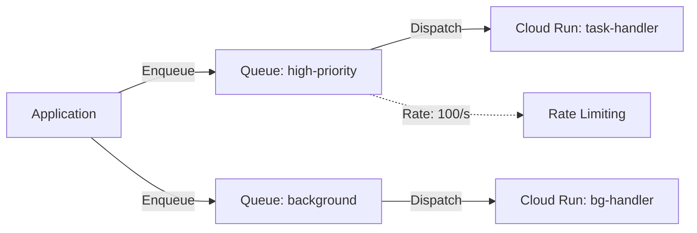

# Deploy Cloud Tasks for Asynchronous Task Processing on GCP

This guide demonstrates how to use MechCloud's stateless IaC to provision Cloud Tasks queues for reliable, asynchronous task execution with rate limiting and retry policies.

## Scenario Overview
**Use Case:** Asynchronous task processing with guaranteed delivery — dispatching HTTP requests to Cloud Run or App Engine handlers with configurable rate limits, retry policies, and scheduling. Ideal for email sending, image processing, and order fulfillment workflows.
**Key MechCloud Features Highlighted:**
- Cross-resource referencing (`ref:`)
- Queue configuration with rate limits and retry policies
- Multiple queues for different priorities

### Architecture Diagram



***

### Complete Unified Template

```yaml
resources:
  - type: gcp_cloud_tasks_queue
    name: high-priority
    props:
      name: "mc-high-priority"
      location: "{{CURRENT_REGION}}"
      rate_limits:
        max_dispatches_per_second: 100
        max_concurrent_dispatches: 50
      retry_config:
        max_attempts: 5
        min_backoff: "1s"
        max_backoff: "300s"
        max_doublings: 4
        max_retry_duration: "3600s"

  - type: gcp_cloud_tasks_queue
    name: background
    props:
      name: "mc-background"
      location: "{{CURRENT_REGION}}"
      rate_limits:
        max_dispatches_per_second: 10
        max_concurrent_dispatches: 5
      retry_config:
        max_attempts: 10
        min_backoff: "10s"
        max_backoff: "3600s"
        max_doublings: 5

  - type: gcp_cloud_tasks_queue
    name: scheduled
    props:
      name: "mc-scheduled"
      location: "{{CURRENT_REGION}}"
      rate_limits:
        max_dispatches_per_second: 5
        max_concurrent_dispatches: 2
      retry_config:
        max_attempts: 3
        min_backoff: "60s"
        max_backoff: "600s"

  - type: gcp_service_account
    name: tasks-sa
    props:
      account_id: "mc-cloud-tasks-sa"
      display_name: "Cloud Tasks Service Account"

  - type: gcp_project_iam_member
    name: tasks-invoker
    props:
      role: roles/run.invoker
      member: "serviceAccount:ref:tasks-sa.email"

  - type: gcp_cloud_tasks_queue_iam_member
    name: queue-enqueuer
    props:
      name: "ref:high-priority"
      location: "{{CURRENT_REGION}}"
      role: roles/cloudtasks.enqueuer
      member: "serviceAccount:ref:tasks-sa.email"
```
