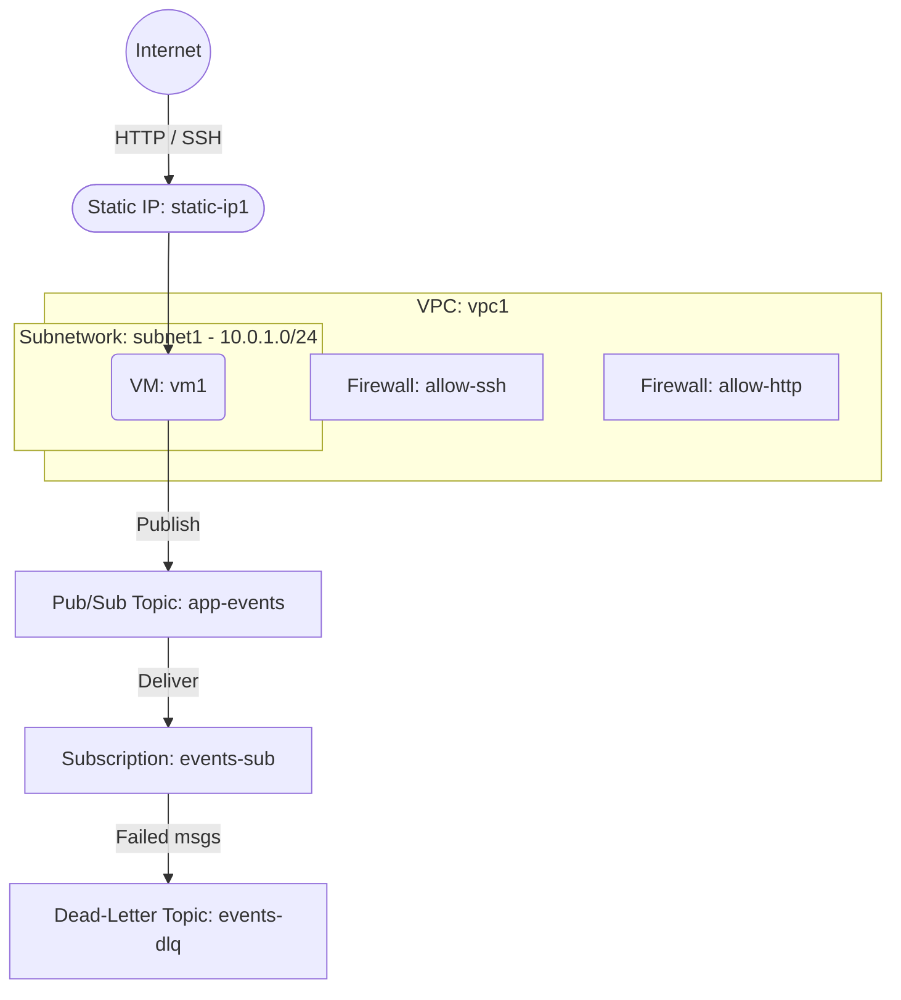

# Deploy a VM with Pub/Sub Topic and Subscription on GCP

This guide demonstrates how to use MechCloud's stateless Infrastructure-as-Code (IaC) to provision a Compute Engine VM with Google Cloud Pub/Sub for asynchronous messaging on Google Cloud Platform.

In this scenario, we deploy a VM alongside a Pub/Sub topic and subscription for event-driven messaging. The VM publishes events to the topic, and a pull subscription enables consumers to process messages asynchronously — ideal for decoupled microservice architectures and background task processing.

## Scenario Overview
**Use Case:** An application that publishes events (e.g., order placed, file uploaded) to a Pub/Sub topic, with subscribers processing those events asynchronously — enabling decoupled, scalable, event-driven architectures.
**Key MechCloud Features Highlighted:**
- Hierarchical resource nesting (VPC → Subnetwork & Firewall)
- Cross-resource referencing (`ref:`)
- Pub/Sub topic and subscription provisioning

### Architecture Diagram



***

### Complete Unified Template

```yaml
defaults:
  zone: us-central1-a

resources:
  - type: google_compute_network
    name: vpc1
    props:
      auto_create_subnetworks: false
    resources:
      - type: google_compute_subnetwork
        name: subnet1
        props:
          ip_cidr_range: "10.0.1.0/24"
          region: us-central1

      - type: google_compute_firewall
        name: allow-ssh
        props:
          direction: INGRESS
          priority: 1000
          source_ranges:
            - "{{CURRENT_IP}}/32"
          allow:
            - protocol: tcp
              ports:
                - "22"

      - type: google_compute_firewall
        name: allow-http
        props:
          direction: INGRESS
          priority: 1000
          source_ranges:
            - "0.0.0.0/0"
          allow:
            - protocol: tcp
              ports:
                - "80"

  - type: google_compute_address
    name: static-ip1
    props:
      address_type: EXTERNAL
      region: us-central1

  - type: google_compute_instance
    name: vm1
    props:
      machine_type: e2-medium
      boot_disk:
        initialize_params:
          image: "{{Image|arm64_ubuntu_24_04}}"
          size: 20
      network_interfaces:
        - subnetwork: "ref:vpc1/subnet1"
          access_configs:
            - nat_ip: "ref:static-ip1"

  - type: google_pubsub_topic
    name: events-dlq
    props:
      message_retention_duration: "1209600s"

  - type: google_pubsub_topic
    name: app-events
    props:
      message_retention_duration: "86400s"

  - type: google_pubsub_subscription
    name: events-sub
    props:
      topic: "ref:app-events"
      ack_deadline_seconds: 60
      message_retention_duration: "604800s"
      retain_acked_messages: false
      dead_letter_policy:
        dead_letter_topic: "ref:events-dlq"
        max_delivery_attempts: 5
      retry_policy:
        minimum_backoff: "10s"
        maximum_backoff: "600s"
```
