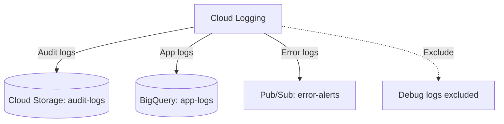

# Deploy Cloud Logging with Log Sinks and Exclusions on GCP

This guide demonstrates how to use MechCloud's stateless IaC to provision Cloud Logging log sinks to route logs to Cloud Storage, BigQuery, and Pub/Sub for centralized log management and analysis.

## Scenario Overview
**Use Case:** Centralized log routing and management that sends audit logs to Cloud Storage for long-term retention, application logs to BigQuery for analytics, and error logs to Pub/Sub for real-time alerting — required for compliance, security investigations, and operational visibility.
**Key MechCloud Features Highlighted:**
- Cross-resource referencing (`ref:`)
- Multiple log sinks with filters
- Log exclusion rules to reduce costs

### Architecture Diagram



***

### Complete Unified Template

```yaml
resources:
  - type: gcp_storage_bucket
    name: audit-logs
    props:
      location: "{{CURRENT_REGION}}"
      storage_class: NEARLINE
      uniform_bucket_level_access: true
      lifecycle_rule:
        - action:
            type: SetStorageClass
            storage_class: COLDLINE
          condition:
            age: 90
        - action:
            type: Delete
          condition:
            age: 365

  - type: gcp_bigquery_dataset
    name: app-logs
    props:
      dataset_id: "mc_app_logs"
      location: "{{CURRENT_REGION}}"
      default_table_expiration_ms: 7776000000
      delete_contents_on_destroy: true

  - type: gcp_pubsub_topic
    name: error-alerts
    props:
      name: "mc-error-alerts"

  - type: gcp_logging_project_sink
    name: audit-sink
    props:
      name: "mc-audit-log-sink"
      destination: "storage.googleapis.com/ref:audit-logs"
      filter: 'logName:"cloudaudit.googleapis.com"'
      unique_writer_identity: true

  - type: gcp_logging_project_sink
    name: app-sink
    props:
      name: "mc-app-log-sink"
      destination: "bigquery.googleapis.com/ref:app-logs"
      filter: 'resource.type="gce_instance" OR resource.type="cloud_run_revision" OR resource.type="k8s_container"'
      unique_writer_identity: true
      bigquery_options:
        use_partitioned_tables: true

  - type: gcp_logging_project_sink
    name: error-sink
    props:
      name: "mc-error-log-sink"
      destination: "pubsub.googleapis.com/ref:error-alerts"
      filter: 'severity >= ERROR'
      unique_writer_identity: true

  - type: gcp_logging_project_exclusion
    name: exclude-debug
    props:
      name: "mc-exclude-debug-logs"
      description: "Exclude debug-level logs to reduce costs"
      filter: 'severity = DEBUG'

  - type: gcp_logging_project_exclusion
    name: exclude-health-checks
    props:
      name: "mc-exclude-health-checks"
      description: "Exclude health check request logs"
      filter: 'httpRequest.requestUrl="/health" OR httpRequest.requestUrl="/healthz"'
```
