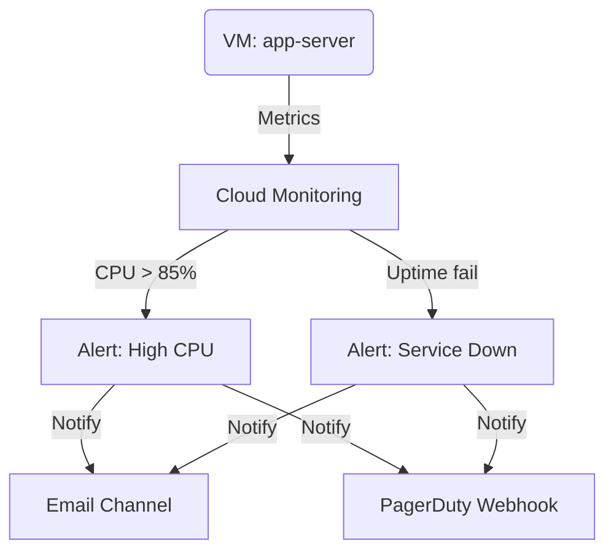

# Deploy Cloud Monitoring Alerts with Notification Channels on GCP

This guide demonstrates how to use MechCloud's stateless IaC to provision Cloud Monitoring alert policies with email and webhook notification channels for proactive infrastructure monitoring.

## Scenario Overview
**Use Case:** Proactive monitoring of VM and service performance with automated alerts when CPU, memory, or uptime metrics breach thresholds — essential for SLA compliance, capacity planning, and rapid incident response.
**Key MechCloud Features Highlighted:**
- Cross-resource referencing (`ref:`)
- Alert policies with conditions as clean YAML
- Multiple notification channels in a single template

### Architecture Diagram



***

### Complete Unified Template

```yaml
resources:
  - type: gcp_monitoring_notification_channel
    name: ops-email
    props:
      display_name: "Ops Team Email"
      type: email
      labels:
        email_address: "ops@example.com"

  - type: gcp_monitoring_notification_channel
    name: pagerduty-webhook
    props:
      display_name: "PagerDuty"
      type: webhook_tokenauth
      labels:
        url: "https://events.pagerduty.com/integration/placeholder/enqueue"

  - type: gcp_monitoring_alert_policy
    name: high-cpu-alert
    props:
      display_name: "High CPU Usage"
      combiner: OR
      conditions:
        - display_name: "CPU > 85% for 5 min"
          condition_threshold:
            filter: 'metric.type="compute.googleapis.com/instance/cpu/utilization" AND resource.type="gce_instance"'
            comparison: COMPARISON_GT
            threshold_value: 0.85
            duration: "300s"
            aggregations:
              - alignment_period: "60s"
                per_series_aligner: ALIGN_MEAN
      notification_channels:
        - "ref:ops-email"
        - "ref:pagerduty-webhook"
      alert_strategy:
        auto_close: "1800s"

  - type: gcp_monitoring_alert_policy
    name: disk-usage-alert
    props:
      display_name: "High Disk Usage"
      combiner: OR
      conditions:
        - display_name: "Disk > 90%"
          condition_threshold:
            filter: 'metric.type="agent.googleapis.com/disk/percent_used" AND resource.type="gce_instance"'
            comparison: COMPARISON_GT
            threshold_value: 90
            duration: "300s"
            aggregations:
              - alignment_period: "60s"
                per_series_aligner: ALIGN_MEAN
      notification_channels:
        - "ref:ops-email"

  - type: gcp_monitoring_uptime_check_config
    name: http-uptime
    props:
      display_name: "HTTP Uptime Check"
      timeout: "10s"
      period: "60s"
      http_check:
        port: 80
        path: "/health"
        request_method: GET
      monitored_resource:
        type: uptime_url
        labels:
          host: "app.example.com"
          project_id: "{{PROJECT_ID}}"
```
