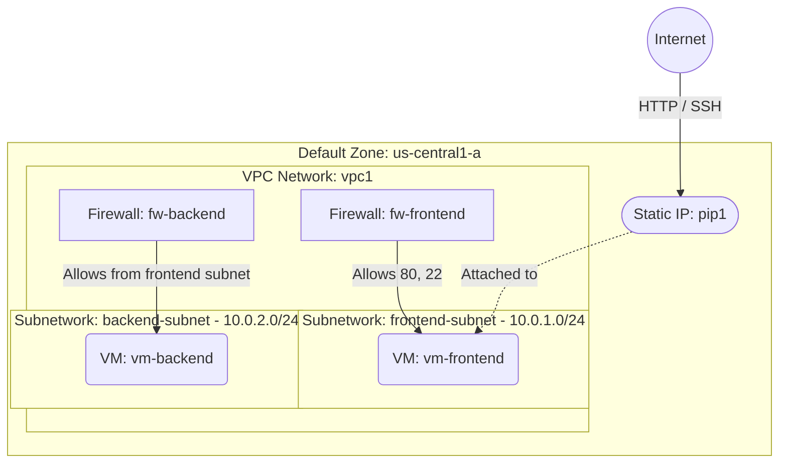

# Deploy a Multi-Subnet VPC with Frontend and Backend VMs on GCP

This guide demonstrates how to use MechCloud's stateless Infrastructure-as-Code (IaC) to provision a VPC Network with multiple subnetworks hosting separate frontend and backend VMs with different firewall policies on Google Cloud Platform.

In this scenario, we create a custom VPC with two subnetworks — a public-facing frontend subnet and a private backend subnet. The frontend VM serves HTTP traffic from the internet with a static external IP, while the backend VM is only accessible from the frontend subnet, implementing a classic two-tier architecture.

## Scenario Overview
**Use Case:** A two-tier application architecture where a web frontend communicates with a private backend service (e.g., API server or database), each isolated in their own subnetwork with tailored firewall rules.
**Key MechCloud Features Highlighted:**
- Zonal defaults injection (`zone: us-central1-a`)
- Hierarchical resource nesting (VPC $\rightarrow$ Subnetwork & Firewall)
- Cross-resource referencing (`ref:`)
- Multiple subnetworks within a single VPC

### Architecture Diagram



***

## Step 1: Setting up the Multi-Subnet VPC

We create a custom VPC with two subnetworks and separate firewall rules for each tier.

```yaml
defaults:
  zone: us-central1-a

resources:
  - type: compute.v1.network
    name: vpc1
    props:
      auto_create_subnetworks: false
    resources:
      # Frontend subnetwork
      - type: compute.v1.subnetwork
        name: frontend-subnet
        props:
          ip_cidr_range: "10.0.1.0/24"

      # Backend subnetwork
      - type: compute.v1.subnetwork
        name: backend-subnet
        props:
          ip_cidr_range: "10.0.2.0/24"

      # Frontend firewall - allows HTTP and SSH
      - type: compute.v1.firewall
        name: fw-frontend-ssh
        props:
          allowed:
            - ip_protocol: tcp
              ports:
                - "22"
          source_ranges:
            - "{{CURRENT_IP}}/32"

      - type: compute.v1.firewall
        name: fw-frontend-http
        props:
          allowed:
            - ip_protocol: tcp
              ports:
                - "80"
          source_ranges:
            - "0.0.0.0/0"

      # Backend firewall - allows traffic only from frontend subnet
      - type: compute.v1.firewall
        name: fw-backend-app
        props:
          allowed:
            - ip_protocol: tcp
              ports:
                - "8080"
          source_ranges:
            - "10.0.1.0/24"

      - type: compute.v1.firewall
        name: fw-backend-ssh
        props:
          allowed:
            - ip_protocol: tcp
              ports:
                - "22"
          source_ranges:
            - "10.0.1.0/24"
```

## Step 2: Creating Static IP and VMs

We allocate a static external IP for the frontend VM and deploy both VMs. The backend VM has no external IP.

```yaml
# ... (Continuing at the root resources level) ...
  # Static External IP for frontend
  - type: compute.v1.address
    name: pip1
    props:
      address_type: EXTERNAL

  # Frontend VM with external IP
  - type: compute.v1.instance
    name: vm-frontend
    props:
      machine_type: machineTypes/e2-micro
      disks:
        - boot: true
          auto_delete: true
          initialize_params:
            disk_size_gb: 30
            disk_type: diskTypes/pd-standard
            source_image: projects/ubuntu-os-cloud/global/images/family/ubuntu-2404-lts
      network_interfaces:
        - subnetwork: "ref:vpc1/frontend-subnet"
          access_configs:
            - type: ONE_TO_ONE_NAT
              name: External NAT
              nat_ip: "ref:pip1"

  # Backend VM (private only)
  - type: compute.v1.instance
    name: vm-backend
    props:
      machine_type: machineTypes/e2-micro
      disks:
        - boot: true
          auto_delete: true
          initialize_params:
            disk_size_gb: 30
            disk_type: diskTypes/pd-standard
            source_image: projects/ubuntu-os-cloud/global/images/family/ubuntu-2404-lts
      network_interfaces:
        - subnetwork: "ref:vpc1/backend-subnet"
```

### Complete Unified Template

For your convenience, here is the complete, unified MechCloud template combining all steps:

```yaml
defaults:
  zone: us-central1-a

resources:
  - type: compute.v1.network
    name: vpc1
    props:
      auto_create_subnetworks: false
    resources:
      - type: compute.v1.subnetwork
        name: frontend-subnet
        props:
          ip_cidr_range: "10.0.1.0/24"

      - type: compute.v1.subnetwork
        name: backend-subnet
        props:
          ip_cidr_range: "10.0.2.0/24"

      - type: compute.v1.firewall
        name: fw-frontend-ssh
        props:
          allowed:
            - ip_protocol: tcp
              ports:
                - "22"
          source_ranges:
            - "{{CURRENT_IP}}/32"

      - type: compute.v1.firewall
        name: fw-frontend-http
        props:
          allowed:
            - ip_protocol: tcp
              ports:
                - "80"
          source_ranges:
            - "0.0.0.0/0"

      - type: compute.v1.firewall
        name: fw-backend-app
        props:
          allowed:
            - ip_protocol: tcp
              ports:
                - "8080"
          source_ranges:
            - "10.0.1.0/24"

      - type: compute.v1.firewall
        name: fw-backend-ssh
        props:
          allowed:
            - ip_protocol: tcp
              ports:
                - "22"
          source_ranges:
            - "10.0.1.0/24"

  - type: compute.v1.address
    name: pip1
    props:
      address_type: EXTERNAL

  - type: compute.v1.instance
    name: vm-frontend
    props:
      machine_type: machineTypes/e2-micro
      disks:
        - boot: true
          auto_delete: true
          initialize_params:
            disk_size_gb: 30
            disk_type: diskTypes/pd-standard
            source_image: projects/ubuntu-os-cloud/global/images/family/ubuntu-2404-lts
      network_interfaces:
        - subnetwork: "ref:vpc1/frontend-subnet"
          access_configs:
            - type: ONE_TO_ONE_NAT
              name: External NAT
              nat_ip: "ref:pip1"

  - type: compute.v1.instance
    name: vm-backend
    props:
      machine_type: machineTypes/e2-micro
      disks:
        - boot: true
          auto_delete: true
          initialize_params:
            disk_size_gb: 30
            disk_type: diskTypes/pd-standard
            source_image: projects/ubuntu-os-cloud/global/images/family/ubuntu-2404-lts
      network_interfaces:
        - subnetwork: "ref:vpc1/backend-subnet"
```
