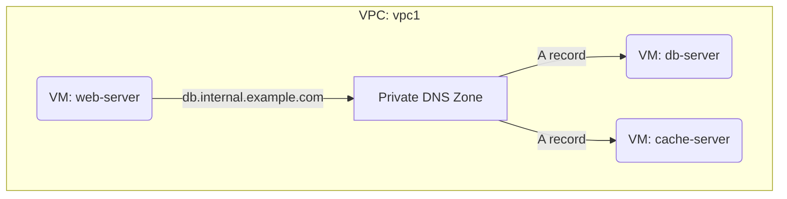

# Deploy Cloud DNS Private Zone for Internal Service Discovery on GCP

This guide demonstrates how to use MechCloud's stateless IaC to provision a Cloud DNS private zone for internal DNS resolution within a VPC — enabling service discovery without exposing internal hostnames to the public internet.

## Scenario Overview
**Use Case:** Internal service discovery where applications use human-readable DNS names (e.g., db.internal.example.com) instead of IP addresses — simplifying microservices communication, enabling zero-downtime failovers, and maintaining clean network architecture.
**Key MechCloud Features Highlighted:**
- Cross-resource referencing (`ref:`)
- Private DNS zone with VPC binding
- Multiple record types in a single template

### Architecture Diagram



***

### Complete Unified Template

```yaml
resources:
  - type: gcp_compute_network
    name: vpc1
    props:
      auto_create_subnetworks: false
    resources:
      - type: gcp_compute_subnetwork
        name: subnet1
        props:
          ip_cidr_range: "10.0.1.0/24"
          region: "{{CURRENT_REGION}}"
      - type: gcp_compute_firewall
        name: fw-internal
        props:
          direction: INGRESS
          allow:
            - protocol: tcp
            - protocol: udp
            - protocol: icmp
          source_ranges:
            - "10.0.0.0/16"

  - type: gcp_compute_instance
    name: db-server
    props:
      machine_type: "e2-standard-4"
      zone: "{{CURRENT_REGION}}-a"
      boot_disk:
        initialize_params:
          image: "ubuntu-os-cloud/ubuntu-2404-lts-amd64"
      network_interface:
        - subnetwork: "ref:vpc1/subnet1"
          network_ip: "10.0.1.10"

  - type: gcp_compute_instance
    name: cache-server
    props:
      machine_type: "e2-standard-2"
      zone: "{{CURRENT_REGION}}-a"
      boot_disk:
        initialize_params:
          image: "ubuntu-os-cloud/ubuntu-2404-lts-amd64"
      network_interface:
        - subnetwork: "ref:vpc1/subnet1"
          network_ip: "10.0.1.20"

  - type: gcp_dns_managed_zone
    name: internal-zone
    props:
      name: "mc-internal"
      dns_name: "internal.example.com."
      description: "Private DNS zone for internal services"
      visibility: private
      private_visibility_config:
        networks:
          - network_url: "ref:vpc1"

  - type: gcp_dns_record_set
    name: db-record
    props:
      managed_zone: "ref:internal-zone"
      name: "db.internal.example.com."
      type: A
      ttl: 300
      rrdatas:
        - "10.0.1.10"

  - type: gcp_dns_record_set
    name: cache-record
    props:
      managed_zone: "ref:internal-zone"
      name: "cache.internal.example.com."
      type: A
      ttl: 300
      rrdatas:
        - "10.0.1.20"

  - type: gcp_dns_record_set
    name: api-cname
    props:
      managed_zone: "ref:internal-zone"
      name: "api.internal.example.com."
      type: CNAME
      ttl: 300
      rrdatas:
        - "db.internal.example.com."
```
