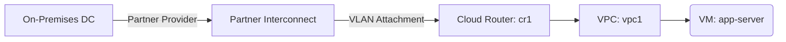

# Deploy Cloud Router with Partner Interconnect on GCP

This guide demonstrates how to use MechCloud's stateless IaC to provision a Cloud Router with VLAN attachments for Partner Interconnect, providing dedicated private connectivity between on-premises infrastructure and GCP.

## Scenario Overview
**Use Case:** Enterprise hybrid connectivity with a dedicated, private connection to GCP through a supported service provider — providing consistent network performance, lower latency, and higher security than VPN for workloads requiring compliance-grade connectivity.
**Key MechCloud Features Highlighted:**
- Cross-resource referencing (`ref:`)
- Cloud Router and interconnect attachment configuration
- BGP session parameters as clean YAML

### Architecture Diagram



***

### Complete Unified Template

```yaml
resources:
  - type: gcp_compute_network
    name: vpc1
    props:
      auto_create_subnetworks: false
    resources:
      - type: gcp_compute_subnetwork
        name: app-subnet
        props:
          ip_cidr_range: "10.0.1.0/24"
          region: "{{CURRENT_REGION}}"
      - type: gcp_compute_firewall
        name: fw-onprem
        props:
          direction: INGRESS
          allow:
            - protocol: tcp
            - protocol: udp
            - protocol: icmp
          source_ranges:
            - "192.168.0.0/16"

  - type: gcp_compute_router
    name: cr1
    props:
      region: "{{CURRENT_REGION}}"
      network: "ref:vpc1"
      bgp:
        asn: 16550
        advertise_mode: CUSTOM
        advertised_groups:
          - ALL_SUBNETS
        advertised_ip_ranges:
          - range: "10.0.0.0/16"
            description: "VPC CIDR"

  - type: gcp_compute_interconnect_attachment
    name: vlan-attachment-primary
    props:
      name: "mc-interconnect-primary"
      region: "{{CURRENT_REGION}}"
      router: "ref:cr1"
      type: PARTNER
      edge_availability_domain: AVAILABILITY_DOMAIN_1

  - type: gcp_compute_interconnect_attachment
    name: vlan-attachment-secondary
    props:
      name: "mc-interconnect-secondary"
      region: "{{CURRENT_REGION}}"
      router: "ref:cr1"
      type: PARTNER
      edge_availability_domain: AVAILABILITY_DOMAIN_2

  - type: gcp_compute_instance
    name: app-server
    props:
      machine_type: "e2-standard-2"
      zone: "{{CURRENT_REGION}}-a"
      boot_disk:
        initialize_params:
          image: "ubuntu-os-cloud/ubuntu-2404-lts-amd64"
      network_interface:
        - subnetwork: "ref:vpc1/app-subnet"
```
