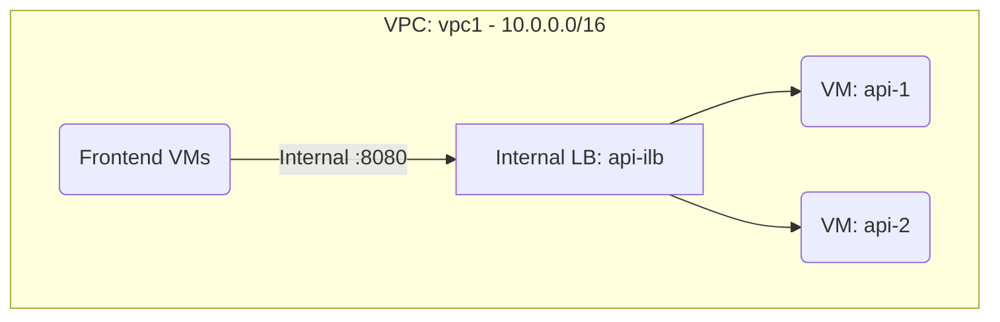

# Deploy an Internal TCP/UDP Load Balancer on GCP

This guide demonstrates how to use MechCloud's stateless IaC to provision an Internal TCP/UDP Load Balancer for distributing traffic across backend VMs within a VPC without exposing services to the internet.

## Scenario Overview
**Use Case:** Internal microservices communication where backend services need load-balanced, private connectivity — ideal for database tiers, internal APIs, and service meshes that should never be exposed to the public internet.
**Key MechCloud Features Highlighted:**
- Cross-resource referencing (`ref:`)
- Internal forwarding rule and backend service configuration
- Health check integration

### Architecture Diagram



***

### Complete Unified Template

```yaml
resources:
  - type: gcp_compute_network
    name: vpc1
    props:
      auto_create_subnetworks: false
    resources:
      - type: gcp_compute_subnetwork
        name: subnet1
        props:
          ip_cidr_range: "10.0.1.0/24"
          region: "{{CURRENT_REGION}}"
      - type: gcp_compute_firewall
        name: fw-internal
        props:
          direction: INGRESS
          allow:
            - protocol: tcp
              ports:
                - "8080"
          source_ranges:
            - "10.0.0.0/16"
      - type: gcp_compute_firewall
        name: fw-health-check
        props:
          direction: INGRESS
          allow:
            - protocol: tcp
              ports:
                - "8080"
          source_ranges:
            - "130.211.0.0/22"
            - "35.191.0.0/16"

  - type: gcp_compute_instance
    name: api-1
    props:
      machine_type: "e2-standard-2"
      zone: "{{CURRENT_REGION}}-a"
      boot_disk:
        initialize_params:
          image: "ubuntu-os-cloud/ubuntu-2404-lts-amd64"
      network_interface:
        - subnetwork: "ref:vpc1/subnet1"

  - type: gcp_compute_instance
    name: api-2
    props:
      machine_type: "e2-standard-2"
      zone: "{{CURRENT_REGION}}-b"
      boot_disk:
        initialize_params:
          image: "ubuntu-os-cloud/ubuntu-2404-lts-amd64"
      network_interface:
        - subnetwork: "ref:vpc1/subnet1"

  - type: gcp_compute_instance_group
    name: api-group-a
    props:
      zone: "{{CURRENT_REGION}}-a"
      instances:
        - "ref:api-1"
      named_port:
        - name: http
          port: 8080

  - type: gcp_compute_instance_group
    name: api-group-b
    props:
      zone: "{{CURRENT_REGION}}-b"
      instances:
        - "ref:api-2"
      named_port:
        - name: http
          port: 8080

  - type: gcp_compute_health_check
    name: api-hc
    props:
      tcp_health_check:
        port: 8080
      check_interval_sec: 10
      timeout_sec: 5

  - type: gcp_compute_region_backend_service
    name: api-backend
    props:
      region: "{{CURRENT_REGION}}"
      protocol: TCP
      health_checks:
        - "ref:api-hc"
      backend:
        - group: "ref:api-group-a"
        - group: "ref:api-group-b"
      load_balancing_scheme: INTERNAL

  - type: gcp_compute_forwarding_rule
    name: api-ilb
    props:
      region: "{{CURRENT_REGION}}"
      load_balancing_scheme: INTERNAL
      backend_service: "ref:api-backend"
      ports:
        - "8080"
      network: "ref:vpc1"
      subnetwork: "ref:vpc1/subnet1"
```
