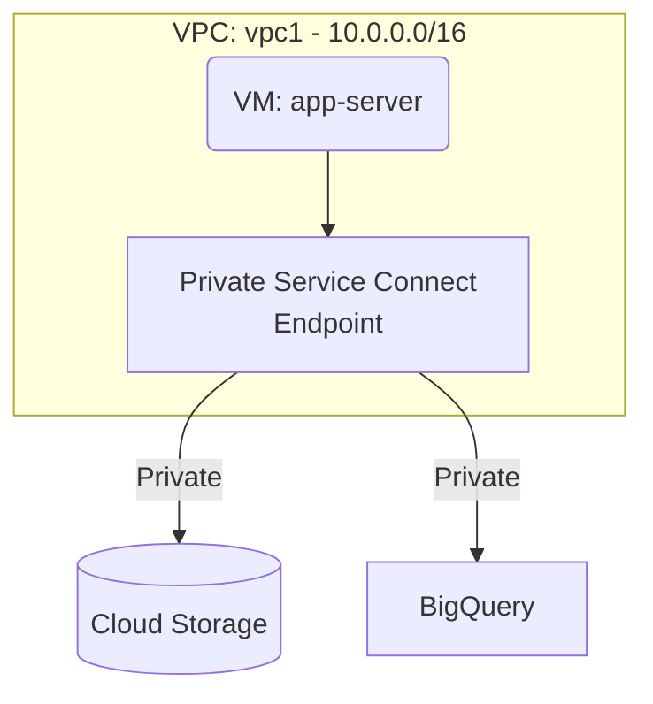

# Deploy Private Service Connect for Google APIs on GCP

This guide demonstrates how to use MechCloud's stateless IaC to provision Private Service Connect endpoints for private access to Google APIs and services without traversing the public internet.

## Scenario Overview
**Use Case:** Securing traffic between your VPC and Google APIs (Cloud Storage, BigQuery, Pub/Sub) by keeping it entirely within Google's network — required for compliance, data exfiltration prevention, and improved security posture.
**Key MechCloud Features Highlighted:**
- Cross-resource referencing (`ref:`)
- Private Service Connect endpoint configuration
- DNS integration for private API access

### Architecture Diagram



***

### Complete Unified Template

```yaml
resources:
  - type: gcp_compute_network
    name: vpc1
    props:
      auto_create_subnetworks: false
    resources:
      - type: gcp_compute_subnetwork
        name: subnet1
        props:
          ip_cidr_range: "10.0.1.0/24"
          region: "{{CURRENT_REGION}}"
          private_ip_google_access: true
      - type: gcp_compute_firewall
        name: fw-internal
        props:
          direction: INGRESS
          allow:
            - protocol: tcp
              ports:
                - "22"
          source_ranges:
            - "{{CURRENT_IP}}/32"

  - type: gcp_compute_global_address
    name: psc-address
    props:
      name: "mc-psc-address"
      address_type: INTERNAL
      purpose: PRIVATE_SERVICE_CONNECT
      network: "ref:vpc1"
      address: "10.0.100.1"

  - type: gcp_compute_global_forwarding_rule
    name: psc-endpoint
    props:
      name: "mc-psc-googleapis"
      target: "all-apis"
      network: "ref:vpc1"
      ip_address: "ref:psc-address"
      load_balancing_scheme: ""

  - type: gcp_dns_managed_zone
    name: googleapis-zone
    props:
      name: "mc-googleapis"
      dns_name: "googleapis.com."
      visibility: private
      private_visibility_config:
        networks:
          - network_url: "ref:vpc1"

  - type: gcp_dns_record_set
    name: googleapis-cname
    props:
      managed_zone: "ref:googleapis-zone"
      name: "*.googleapis.com."
      type: CNAME
      ttl: 300
      rrdatas:
        - "googleapis.com."

  - type: gcp_dns_record_set
    name: googleapis-a
    props:
      managed_zone: "ref:googleapis-zone"
      name: "googleapis.com."
      type: A
      ttl: 300
      rrdatas:
        - "ref:psc-address.address"

  - type: gcp_compute_instance
    name: app-server
    props:
      machine_type: "e2-standard-2"
      zone: "{{CURRENT_REGION}}-a"
      boot_disk:
        initialize_params:
          image: "ubuntu-os-cloud/ubuntu-2404-lts-amd64"
      network_interface:
        - subnetwork: "ref:vpc1/subnet1"
```
