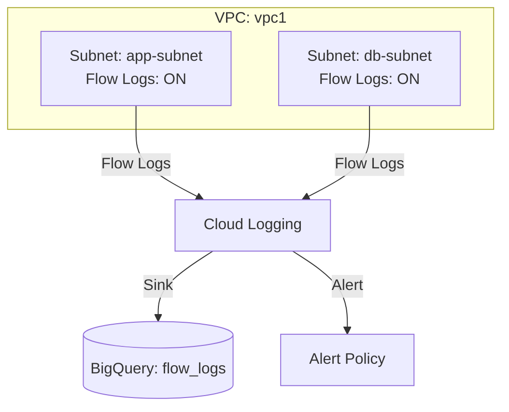

# Deploy VPC Flow Logs with Cloud Logging on GCP

This guide demonstrates how to use MechCloud's stateless IaC to provision VPC subnets with flow logs enabled for network traffic analysis, security forensics, and compliance auditing.

## Scenario Overview
**Use Case:** Network traffic visibility for security monitoring, troubleshooting, and compliance — VPC Flow Logs capture metadata about IP traffic flowing to and from network interfaces, enabling threat detection and traffic analysis.
**Key MechCloud Features Highlighted:**
- Cross-resource referencing (`ref:`)
- Flow log configuration as subnet properties
- Log sink to BigQuery for analytics

### Architecture Diagram



***

### Complete Unified Template

```yaml
resources:
  - type: gcp_compute_network
    name: vpc1
    props:
      auto_create_subnetworks: false
    resources:
      - type: gcp_compute_subnetwork
        name: app-subnet
        props:
          ip_cidr_range: "10.0.1.0/24"
          region: "{{CURRENT_REGION}}"
          log_config:
            aggregation_interval: INTERVAL_5_SEC
            flow_sampling: 0.5
            metadata: INCLUDE_ALL_METADATA
            filter_expr: "true"
      - type: gcp_compute_subnetwork
        name: db-subnet
        props:
          ip_cidr_range: "10.0.2.0/24"
          region: "{{CURRENT_REGION}}"
          log_config:
            aggregation_interval: INTERVAL_10_MIN
            flow_sampling: 1.0
            metadata: INCLUDE_ALL_METADATA
      - type: gcp_compute_firewall
        name: fw-ssh
        props:
          direction: INGRESS
          allow:
            - protocol: tcp
              ports:
                - "22"
          source_ranges:
            - "{{CURRENT_IP}}/32"

  - type: gcp_bigquery_dataset
    name: flow-logs-dataset
    props:
      dataset_id: "mc_vpc_flow_logs"
      location: "{{CURRENT_REGION}}"
      default_table_expiration_ms: 7776000000
      delete_contents_on_destroy: true

  - type: gcp_logging_project_sink
    name: flow-logs-sink
    props:
      name: "mc-flow-logs-to-bq"
      destination: "bigquery.googleapis.com/ref:flow-logs-dataset"
      filter: 'resource.type="gce_subnetwork" AND log_name:"compute.googleapis.com/vpc_flows"'
      unique_writer_identity: true

  - type: gcp_monitoring_alert_policy
    name: suspicious-traffic
    props:
      display_name: "Suspicious Network Traffic"
      combiner: OR
      conditions:
        - display_name: "High outbound traffic"
          condition_threshold:
            filter: 'metric.type="compute.googleapis.com/instance/network/sent_bytes_count" AND resource.type="gce_instance"'
            comparison: COMPARISON_GT
            threshold_value: 1073741824
            duration: "300s"
            aggregations:
              - alignment_period: "300s"
                per_series_aligner: ALIGN_RATE
```
