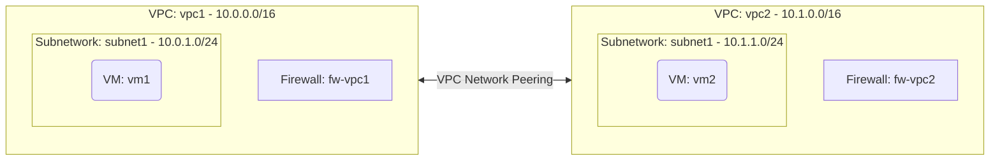

# Deploy Two Peered VPC Networks on GCP

This guide demonstrates how to use MechCloud's stateless Infrastructure-as-Code (IaC) to provision two VPC Networks connected via VPC Network Peering on Google Cloud Platform.

In this scenario, we create two separate VPC Networks — each with its own subnetwork and VM — and establish bidirectional VPC Network Peering between them. This allows resources in both VPCs to communicate with each other using internal IP addresses over Google's private network fabric.

## Scenario Overview
**Use Case:** Connecting separate application environments (e.g., development and staging), linking a shared services VPC to an application VPC, or enabling cross-team resource communication within an organization.
**Key MechCloud Features Highlighted:**
- Zonal defaults injection (`zone: us-central1-a`)
- Hierarchical resource nesting (VPC $\rightarrow$ Subnetwork & Firewall)
- Cross-resource referencing (`ref:`)
- Bidirectional VPC Network Peering

### Architecture Diagram



***

## Step 1: Creating Two VPC Networks

We provision two VPC Networks with non-overlapping CIDR blocks, each containing a subnetwork and firewall rules allowing SSH from the other network.

```yaml
defaults:
  zone: us-central1-a

resources:
  # 1. First VPC Network
  - type: compute.v1.network
    name: vpc1
    props:
      auto_create_subnetworks: false
    resources:
      - type: compute.v1.subnetwork
        name: subnet1
        props:
          ip_cidr_range: "10.0.1.0/24"

      - type: compute.v1.firewall
        name: fw-vpc1-allow-internal
        props:
          allowed:
            - ip_protocol: tcp
              ports:
                - "22"
            - ip_protocol: icmp
          source_ranges:
            - "10.0.0.0/8"

  # 2. Second VPC Network
  - type: compute.v1.network
    name: vpc2
    props:
      auto_create_subnetworks: false
    resources:
      - type: compute.v1.subnetwork
        name: subnet1
        props:
          ip_cidr_range: "10.1.1.0/24"

      - type: compute.v1.firewall
        name: fw-vpc2-allow-internal
        props:
          allowed:
            - ip_protocol: tcp
              ports:
                - "22"
            - ip_protocol: icmp
          source_ranges:
            - "10.0.0.0/8"
```

## Step 2: Establishing Bidirectional VPC Peering

We create peering connections in both directions. Each VPC needs its own peering resource that points to the other VPC.

```yaml
# ... (Continuing at the root resources level) ...
  # 3. Peering from vpc1 to vpc2
  - type: compute.v1.networkPeering
    name: peer-vpc1-to-vpc2
    props:
      network: "ref:vpc1"
      peer_network: "ref:vpc2"
      exchange_subnet_routes: true

  # 4. Peering from vpc2 to vpc1
  - type: compute.v1.networkPeering
    name: peer-vpc2-to-vpc1
    props:
      network: "ref:vpc2"
      peer_network: "ref:vpc1"
      exchange_subnet_routes: true
```

## Step 3: Provisioning VMs in Each VPC

We deploy one VM in each VPC. Thanks to VPC Peering, these VMs can communicate using their internal IP addresses.

```yaml
# ... (Continuing at the root resources level) ...
  # 5. VM in VPC1
  - type: compute.v1.instance
    name: vm1
    props:
      machine_type: machineTypes/e2-micro
      disks:
        - boot: true
          auto_delete: true
          initialize_params:
            disk_size_gb: 30
            disk_type: diskTypes/pd-standard
            source_image: projects/ubuntu-os-cloud/global/images/family/ubuntu-2404-lts
      network_interfaces:
        - subnetwork: "ref:vpc1/subnet1"

  # 6. VM in VPC2
  - type: compute.v1.instance
    name: vm2
    props:
      machine_type: machineTypes/e2-micro
      disks:
        - boot: true
          auto_delete: true
          initialize_params:
            disk_size_gb: 30
            disk_type: diskTypes/pd-standard
            source_image: projects/ubuntu-os-cloud/global/images/family/ubuntu-2404-lts
      network_interfaces:
        - subnetwork: "ref:vpc2/subnet1"
```

### Complete Unified Template

For your convenience, here is the complete, unified MechCloud template combining all steps:

```yaml
defaults:
  zone: us-central1-a

resources:
  - type: compute.v1.network
    name: vpc1
    props:
      auto_create_subnetworks: false
    resources:
      - type: compute.v1.subnetwork
        name: subnet1
        props:
          ip_cidr_range: "10.0.1.0/24"

      - type: compute.v1.firewall
        name: fw-vpc1-allow-internal
        props:
          allowed:
            - ip_protocol: tcp
              ports:
                - "22"
            - ip_protocol: icmp
          source_ranges:
            - "10.0.0.0/8"

  - type: compute.v1.network
    name: vpc2
    props:
      auto_create_subnetworks: false
    resources:
      - type: compute.v1.subnetwork
        name: subnet1
        props:
          ip_cidr_range: "10.1.1.0/24"

      - type: compute.v1.firewall
        name: fw-vpc2-allow-internal
        props:
          allowed:
            - ip_protocol: tcp
              ports:
                - "22"
            - ip_protocol: icmp
          source_ranges:
            - "10.0.0.0/8"

  - type: compute.v1.networkPeering
    name: peer-vpc1-to-vpc2
    props:
      network: "ref:vpc1"
      peer_network: "ref:vpc2"
      exchange_subnet_routes: true

  - type: compute.v1.networkPeering
    name: peer-vpc2-to-vpc1
    props:
      network: "ref:vpc2"
      peer_network: "ref:vpc1"
      exchange_subnet_routes: true

  - type: compute.v1.instance
    name: vm1
    props:
      machine_type: machineTypes/e2-micro
      disks:
        - boot: true
          auto_delete: true
          initialize_params:
            disk_size_gb: 30
            disk_type: diskTypes/pd-standard
            source_image: projects/ubuntu-os-cloud/global/images/family/ubuntu-2404-lts
      network_interfaces:
        - subnetwork: "ref:vpc1/subnet1"

  - type: compute.v1.instance
    name: vm2
    props:
      machine_type: machineTypes/e2-micro
      disks:
        - boot: true
          auto_delete: true
          initialize_params:
            disk_size_gb: 30
            disk_type: diskTypes/pd-standard
            source_image: projects/ubuntu-os-cloud/global/images/family/ubuntu-2404-lts
      network_interfaces:
        - subnetwork: "ref:vpc2/subnet1"
```
