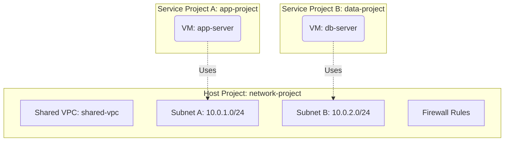

# Deploy a Shared VPC for Multi-Project Networking on GCP

This guide demonstrates how to use MechCloud's stateless IaC to provision a Shared VPC that allows multiple GCP projects to share a common VPC network for centralized network management.

## Scenario Overview
**Use Case:** Enterprise network architecture where a host project owns the VPC and subnets while service projects consume them — enabling centralized network control, firewall management, and IP address planning across multiple teams and projects.
**Key MechCloud Features Highlighted:**
- Cross-resource referencing (`ref:`)
- Shared VPC host and service project configuration
- Multi-project resource sharing

### Architecture Diagram



***

### Complete Unified Template

```yaml
resources:
  - type: gcp_compute_network
    name: shared-vpc
    props:
      auto_create_subnetworks: false
    resources:
      - type: gcp_compute_subnetwork
        name: app-subnet
        props:
          ip_cidr_range: "10.0.1.0/24"
          region: "{{CURRENT_REGION}}"
          log_config:
            aggregation_interval: INTERVAL_5_SEC
            flow_sampling: 0.5
            metadata: INCLUDE_ALL_METADATA
      - type: gcp_compute_subnetwork
        name: data-subnet
        props:
          ip_cidr_range: "10.0.2.0/24"
          region: "{{CURRENT_REGION}}"
      - type: gcp_compute_firewall
        name: fw-allow-internal
        props:
          direction: INGRESS
          allow:
            - protocol: tcp
            - protocol: udp
            - protocol: icmp
          source_ranges:
            - "10.0.0.0/16"
      - type: gcp_compute_firewall
        name: fw-allow-ssh
        props:
          direction: INGRESS
          allow:
            - protocol: tcp
              ports:
                - "22"
          source_ranges:
            - "{{CURRENT_IP}}/32"
      - type: gcp_compute_firewall
        name: fw-allow-health-check
        props:
          direction: INGRESS
          allow:
            - protocol: tcp
              ports:
                - "80"
                - "443"
          source_ranges:
            - "130.211.0.0/22"
            - "35.191.0.0/16"

  - type: gcp_compute_shared_vpc_host_project
    name: host-project
    props:
      project: "{{PROJECT_ID}}"

  - type: gcp_compute_instance
    name: app-server
    props:
      machine_type: "e2-standard-2"
      zone: "{{CURRENT_REGION}}-a"
      boot_disk:
        initialize_params:
          image: "ubuntu-os-cloud/ubuntu-2404-lts-amd64"
      network_interface:
        - subnetwork: "ref:shared-vpc/app-subnet"

  - type: gcp_compute_instance
    name: data-server
    props:
      machine_type: "e2-standard-4"
      zone: "{{CURRENT_REGION}}-a"
      boot_disk:
        initialize_params:
          image: "ubuntu-os-cloud/ubuntu-2404-lts-amd64"
      network_interface:
        - subnetwork: "ref:shared-vpc/data-subnet"
```
