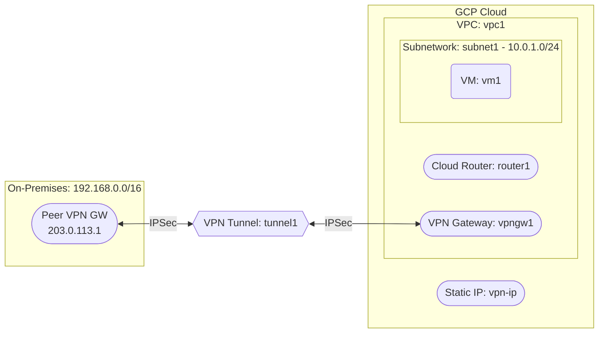

# Deploy a VPC with Cloud VPN for Site-to-Site VPN on GCP

This guide demonstrates how to use MechCloud's stateless Infrastructure-as-Code (IaC) to provision a VPC Network with Cloud VPN for establishing a site-to-site VPN connection to an on-premises network on Google Cloud Platform.

In this scenario, we create a VPC with a Cloud Router, a VPN Gateway, and a VPN Tunnel connecting to an on-premises peer VPN gateway. This enables secure hybrid connectivity between GCP and on-premises infrastructure over an encrypted IPSec tunnel.

## Scenario Overview
**Use Case:** Securely extending an on-premises data center to GCP, enabling hybrid architectures where cloud workloads communicate with on-premises resources over an encrypted VPN tunnel.
**Key MechCloud Features Highlighted:**
- Hierarchical resource nesting (VPC → Subnetwork & Firewall)
- Cross-resource referencing (`ref:`)
- Cloud VPN Gateway, Tunnel, and Router configuration

### Architecture Diagram



***

### Complete Unified Template

```yaml
defaults:
  zone: us-central1-a

resources:
  - type: google_compute_network
    name: vpc1
    props:
      auto_create_subnetworks: false
    resources:
      - type: google_compute_subnetwork
        name: subnet1
        props:
          ip_cidr_range: "10.0.1.0/24"
          region: us-central1

      - type: google_compute_firewall
        name: allow-ssh-onprem
        props:
          direction: INGRESS
          priority: 1000
          source_ranges:
            - "192.168.0.0/16"
          allow:
            - protocol: tcp
              ports:
                - "22"

      - type: google_compute_firewall
        name: allow-icmp-onprem
        props:
          direction: INGRESS
          priority: 1000
          source_ranges:
            - "192.168.0.0/16"
          allow:
            - protocol: icmp

  - type: google_compute_address
    name: vpn-ip
    props:
      address_type: EXTERNAL
      region: us-central1

  - type: google_compute_vpn_gateway
    name: vpngw1
    props:
      network: "ref:vpc1"
      region: us-central1

  - type: google_compute_router
    name: router1
    props:
      network: "ref:vpc1"
      region: us-central1

  - type: google_compute_vpn_tunnel
    name: tunnel1
    props:
      target_vpn_gateway: "ref:vpngw1"
      peer_ip: "203.0.113.1"
      shared_secret: "YourSharedKeyHere123!"
      local_traffic_selector:
        - "10.0.0.0/16"
      remote_traffic_selector:
        - "192.168.0.0/16"
      region: us-central1

  - type: google_compute_route
    name: route-to-onprem
    props:
      network: "ref:vpc1"
      dest_range: "192.168.0.0/16"
      next_hop_vpn_tunnel: "ref:tunnel1"
      priority: 1000

  - type: google_compute_forwarding_rule
    name: vpn-esp
    props:
      ip_protocol: ESP
      ip_address: "ref:vpn-ip"
      target: "ref:vpngw1"
      region: us-central1

  - type: google_compute_forwarding_rule
    name: vpn-udp500
    props:
      ip_protocol: UDP
      port_range: "500"
      ip_address: "ref:vpn-ip"
      target: "ref:vpngw1"
      region: us-central1

  - type: google_compute_forwarding_rule
    name: vpn-udp4500
    props:
      ip_protocol: UDP
      port_range: "4500"
      ip_address: "ref:vpn-ip"
      target: "ref:vpngw1"
      region: us-central1

  - type: google_compute_instance
    name: vm1
    props:
      machine_type: e2-medium
      boot_disk:
        initialize_params:
          image: "{{Image|arm64_ubuntu_24_04}}"
          size: 20
      network_interfaces:
        - subnetwork: "ref:vpc1/subnet1"
```
