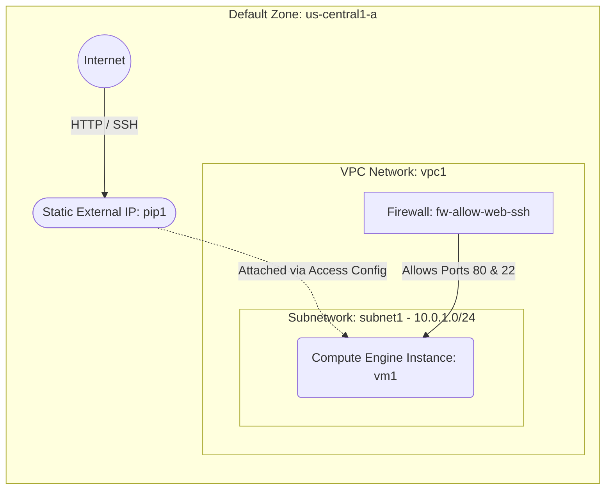

# Deploy a Public Web Application VM with a Static IP on GCP

This guide demonstrates how to use MechCloud's stateless Infrastructure-as-Code (IaC) to provision the foundational infrastructure for a public-facing web application or backend server on Google Cloud Platform (GCP). 

In this scenario, we will provision a Compute Engine Virtual Machine (VM) inside a custom VPC Network. To make the application accessible to the internet with a fixed address, we will provision a Static External IP and attach it to the VM's Network Interface. MechCloud's hierarchical syntax automatically infers parent-child relationships (like VPCs and Subnets) without requiring complex logical IDs.

## Scenario Overview
**Use Case:** Hosting a web application or API backend that requires a dedicated public IP address and external internet access, while securely restricting SSH access only to your current IP.
**Key MechCloud Features Highlighted:**
- Zonal defaults injection (`zone: us-central1-a`)
- Hierarchical resource nesting (VPC $\rightarrow$ Subnetwork & Firewall)
- Automatic parent-link inference
- `snake_case` property conversion
- Cross-resource referencing (`ref:`)

### Architecture Diagram



***

## Step 1: Setting up Networking and Security

The first step is establishing the network boundary. We create a custom VPC Network (disabling automatic subnet creation) and nest a Subnetwork inside it. We also nest a Firewall rule inside the VPC to control inbound traffic. Because these are nested under `vpc1`, MechCloud automatically links them to the parent network without requiring explicit `network` references.

```yaml
defaults:
  zone: us-central1-a

resources:
  # 1. Define the VPC Network
  - type: compute.v1.network
    name: vpc1
    props:
      auto_create_subnetworks: false
    resources:
      # 2. Define the Subnetwork (Network link is inferred via nesting)
      - type: compute.v1.subnetwork
        name: subnet1
        props:
          ip_cidr_range: "10.0.1.0/24"
          
      # 3a. Security rule for restricted SSH access
      - type: compute.v1.firewall
        name: fw-allow-ssh
        props:
          allowed:
            - ip_protocol: tcp
              ports:
                - "22"
          source_ranges:
            - "{{CURRENT_IP}}/32"

      # 3b. Security rule for open HTTP access
      - type: compute.v1.firewall
        name: fw-allow-web
        props:
          allowed:
            - ip_protocol: tcp
              ports:
                - "80"
          source_ranges:
            - "0.0.0.0/0"
```

## Step 2: Provisioning a Static External IP

To ensure the web application has a reliable entry point that survives instance reboots, we allocate a Static External IP address. 

```yaml
# ... (Continuing at the root resources level) ...
  # 4. Create a Static External IP Address
  - type: compute.v1.address
    name: pip1
    props:
      address_type: EXTERNAL
```

## Step 3: Provisioning the VM

With the networking foundation in place, we provision the compute resource. We define a single `e2-small` Virtual Machine running Ubuntu 24.04. We attach it to the nested subnet using the cross-resource path reference (`ref:vpc1/subnet1`), and we expose it to the internet by mapping our Static IP (`ref:pip1`) into the `access_configs` block. 

```yaml
# ... (Continuing at the root resources level) ...
  # 5. Create the Virtual Machine Instance
  - type: compute.v1.instance
    name: vm1
    props:
      machine_type: machineTypes/e2-small
      disks:
        - boot: true
          auto_delete: true
          initialize_params:
            disk_size_gb: 30
            disk_type: diskTypes/pd-standard
            source_image: projects/ubuntu-os-cloud/global/images/family/ubuntu-2404-lts
      network_interfaces:
        - subnetwork: "ref:vpc1/subnet1"
          access_configs:
            - type: ONE_TO_ONE_NAT
              name: External NAT
              nat_ip: "ref:pip1"
```

### Complete Unified Template

For your convenience, here is the complete, unified MechCloud template combining all three steps:

```yaml
defaults:
  zone: us-central1-a
  
resources:
  - type: compute.v1.network
    name: vpc1
    props:
      auto_create_subnetworks: false
    resources:
      - type: compute.v1.subnetwork
        name: subnet1
        props:
          ip_cidr_range: "10.0.1.0/24"
          
      - type: compute.v1.firewall
        name: fw-allow-web-ssh
        props:
          allowed:
            - ip_protocol: tcp
              ports:
                - "22"
                - "80"
          source_ranges:
            - "{{CURRENT_IP}}/32"
            - "0.0.0.0/0"

  - type: compute.v1.address
    name: pip1
    props:
      address_type: EXTERNAL

  - type: compute.v1.instance
    name: vm1
    props:
      machine_type: machineTypes/e2-small
      disks:
        - boot: true
          auto_delete: true
          initialize_params:
            disk_size_gb: 30
            disk_type: diskTypes/pd-standard
            source_image: projects/ubuntu-os-cloud/global/images/family/ubuntu-2404-lts
      network_interfaces:
        - subnetwork: "ref:vpc1/subnet1"
          access_configs:
            - type: ONE_TO_ONE_NAT
              name: External NAT
              nat_ip: "ref:pip1"
```