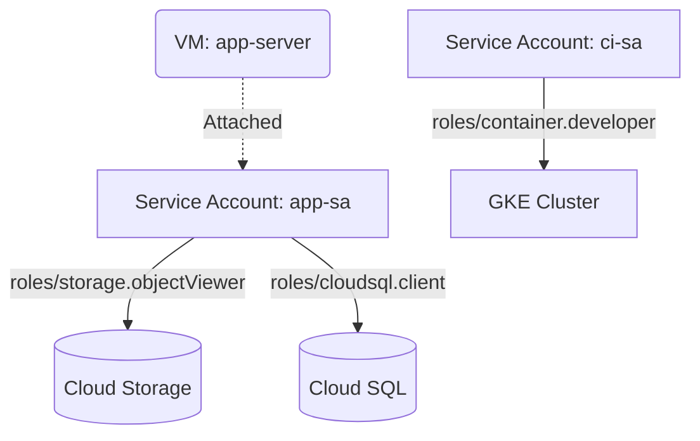

# Deploy IAM Service Accounts with Role Bindings on GCP

This guide demonstrates how to use MechCloud's stateless IaC to provision GCP service accounts with fine-grained IAM role bindings for secure workload identity.

## Scenario Overview
**Use Case:** Creating dedicated service accounts with least-privilege IAM roles for applications — eliminating the use of default compute service accounts and reducing the blast radius of credential compromise.
**Key MechCloud Features Highlighted:**
- Cross-resource referencing (`ref:`)
- Multiple role bindings in a single template
- Service account key management

### Architecture Diagram



***

### Complete Unified Template

```yaml
resources:
  - type: gcp_service_account
    name: app-sa
    props:
      account_id: "mc-app-sa"
      display_name: "Application Service Account"
      description: "Service account for application workloads"

  - type: gcp_service_account
    name: ci-sa
    props:
      account_id: "mc-ci-sa"
      display_name: "CI/CD Service Account"
      description: "Service account for CI/CD pipelines"

  - type: gcp_project_iam_member
    name: app-storage-viewer
    props:
      role: roles/storage.objectViewer
      member: "serviceAccount:ref:app-sa.email"

  - type: gcp_project_iam_member
    name: app-sql-client
    props:
      role: roles/cloudsql.client
      member: "serviceAccount:ref:app-sa.email"

  - type: gcp_project_iam_member
    name: app-logging-writer
    props:
      role: roles/logging.logWriter
      member: "serviceAccount:ref:app-sa.email"

  - type: gcp_project_iam_member
    name: ci-container-dev
    props:
      role: roles/container.developer
      member: "serviceAccount:ref:ci-sa.email"

  - type: gcp_project_iam_member
    name: ci-storage-admin
    props:
      role: roles/storage.admin
      member: "serviceAccount:ref:ci-sa.email"

  - type: gcp_compute_network
    name: vpc1
    props:
      auto_create_subnetworks: false
    resources:
      - type: gcp_compute_subnetwork
        name: subnet1
        props:
          ip_cidr_range: "10.0.1.0/24"
          region: "{{CURRENT_REGION}}"
      - type: gcp_compute_firewall
        name: fw-ssh
        props:
          direction: INGRESS
          allow:
            - protocol: tcp
              ports:
                - "22"
          source_ranges:
            - "{{CURRENT_IP}}/32"

  - type: gcp_compute_instance
    name: app-server
    props:
      machine_type: "e2-standard-2"
      zone: "{{CURRENT_REGION}}-a"
      boot_disk:
        initialize_params:
          image: "ubuntu-os-cloud/ubuntu-2404-lts-amd64"
      network_interface:
        - subnetwork: "ref:vpc1/subnet1"
      service_account:
        email: "ref:app-sa.email"
        scopes:
          - "https://www.googleapis.com/auth/cloud-platform"
```
