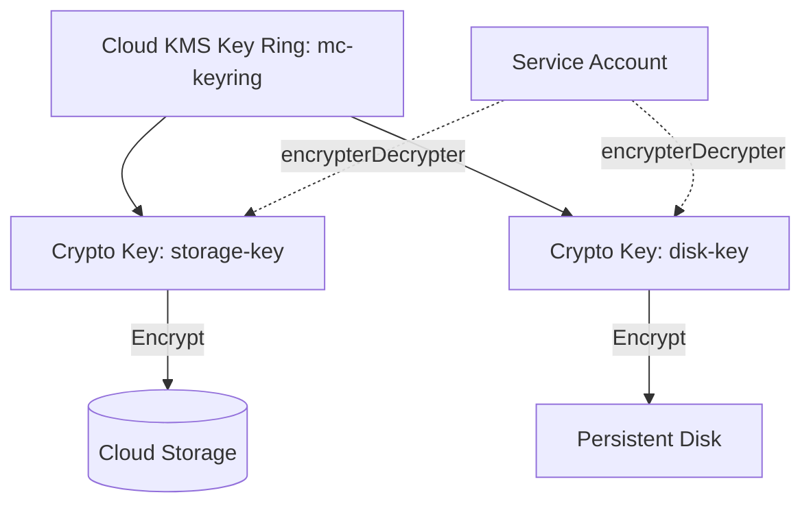

# Deploy Cloud KMS for Encryption Key Management on GCP

This guide demonstrates how to use MechCloud's stateless IaC to provision Cloud KMS key rings and crypto keys for managing encryption across GCP resources.

## Scenario Overview
**Use Case:** Customer-managed encryption keys (CMEK) for encrypting Cloud Storage, BigQuery, Compute Engine disks, and Cloud SQL data — required for compliance standards that mandate key management controls and key rotation policies.
**Key MechCloud Features Highlighted:**
- Cross-resource referencing (`ref:`)
- Key ring and crypto key configuration as clean YAML
- IAM bindings for key access

### Architecture Diagram



***

### Complete Unified Template

```yaml
resources:
  - type: gcp_kms_key_ring
    name: mc-keyring
    props:
      name: "mc-keyring"
      location: "{{CURRENT_REGION}}"

  - type: gcp_kms_crypto_key
    name: storage-key
    props:
      name: "mc-storage-key"
      key_ring: "ref:mc-keyring"
      rotation_period: "7776000s"
      purpose: ENCRYPT_DECRYPT
      version_template:
        algorithm: GOOGLE_SYMMETRIC_ENCRYPTION
        protection_level: SOFTWARE

  - type: gcp_kms_crypto_key
    name: disk-key
    props:
      name: "mc-disk-key"
      key_ring: "ref:mc-keyring"
      rotation_period: "7776000s"
      purpose: ENCRYPT_DECRYPT

  - type: gcp_kms_crypto_key
    name: db-key
    props:
      name: "mc-db-key"
      key_ring: "ref:mc-keyring"
      rotation_period: "7776000s"
      purpose: ENCRYPT_DECRYPT

  - type: gcp_service_account
    name: app-sa
    props:
      account_id: "mc-kms-app-sa"
      display_name: "Application SA for KMS"

  - type: gcp_kms_crypto_key_iam_member
    name: storage-key-access
    props:
      crypto_key_id: "ref:storage-key"
      role: roles/cloudkms.cryptoKeyEncrypterDecrypter
      member: "serviceAccount:ref:app-sa.email"

  - type: gcp_kms_crypto_key_iam_member
    name: disk-key-access
    props:
      crypto_key_id: "ref:disk-key"
      role: roles/cloudkms.cryptoKeyEncrypterDecrypter
      member: "serviceAccount:ref:app-sa.email"

  - type: gcp_storage_bucket
    name: encrypted-bucket
    props:
      location: "{{CURRENT_REGION}}"
      uniform_bucket_level_access: true
      encryption:
        default_kms_key_name: "ref:storage-key"

  - type: gcp_compute_disk
    name: encrypted-disk
    props:
      zone: "{{CURRENT_REGION}}-a"
      size: 100
      type: pd-ssd
      disk_encryption_key:
        kms_key_self_link: "ref:disk-key"
```
