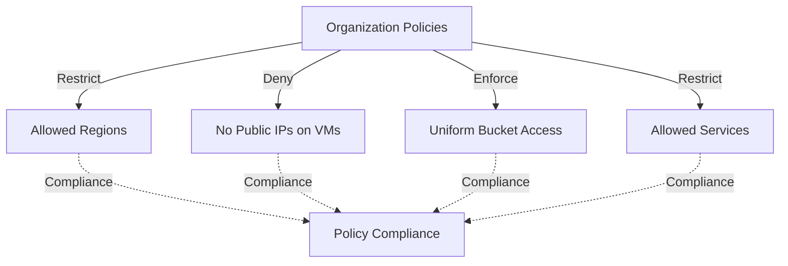

# Deploy Organization Policy Constraints on GCP

This guide demonstrates how to use MechCloud's stateless IaC to provision GCP Organization Policy constraints for automated governance, compliance enforcement, and cost control.

## Scenario Overview
**Use Case:** Automated governance that enforces organizational standards — restricting VM regions for data residency, disabling public IP assignment for security, enforcing uniform bucket access, and restricting resource creation to approved services.
**Key MechCloud Features Highlighted:**
- Policy constraint configuration as clean YAML
- Multiple policy constraints in a single template
- Boolean and list-based constraints

### Architecture Diagram



***

### Complete Unified Template

```yaml
resources:
  # Restrict resource locations for data residency
  - type: gcp_org_policy_policy
    name: restrict-locations
    props:
      parent: "projects/{{PROJECT_ID}}"
      name: "constraints/gcp.resourceLocations"
      spec:
        rules:
          - values:
              allowed_values:
                - "in:us-locations"
                - "in:eu-locations"

  # Disable VM external IPs for security
  - type: gcp_org_policy_policy
    name: disable-vm-external-ip
    props:
      parent: "projects/{{PROJECT_ID}}"
      name: "constraints/compute.vmExternalIpAccess"
      spec:
        rules:
          - deny_all: true

  # Enforce uniform bucket-level access
  - type: gcp_org_policy_policy
    name: uniform-bucket-access
    props:
      parent: "projects/{{PROJECT_ID}}"
      name: "constraints/storage.uniformBucketLevelAccess"
      spec:
        rules:
          - enforce: true

  # Require OS Login for SSH access
  - type: gcp_org_policy_policy
    name: require-os-login
    props:
      parent: "projects/{{PROJECT_ID}}"
      name: "constraints/compute.requireOsLogin"
      spec:
        rules:
          - enforce: true

  # Disable default service account creation
  - type: gcp_org_policy_policy
    name: disable-default-sa
    props:
      parent: "projects/{{PROJECT_ID}}"
      name: "constraints/iam.automaticIamGrantsForDefaultServiceAccounts"
      spec:
        rules:
          - enforce: true

  # Restrict allowed VM machine types for cost control
  - type: gcp_org_policy_policy
    name: restrict-vm-types
    props:
      parent: "projects/{{PROJECT_ID}}"
      name: "constraints/compute.restrictMachineTypes"
      spec:
        rules:
          - values:
              allowed_values:
                - "e2-micro"
                - "e2-small"
                - "e2-medium"
                - "e2-standard-2"
                - "e2-standard-4"
                - "e2-standard-8"
```
