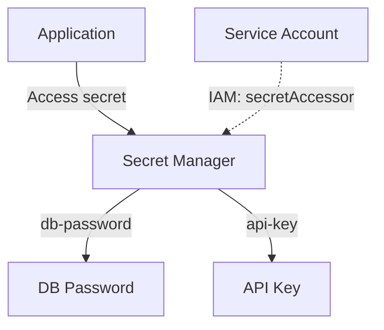

# Deploy Secret Manager with Secrets and IAM Bindings on GCP

This guide demonstrates how to use MechCloud's stateless IaC to provision Secret Manager secrets with version management and IAM-based access control.

## Scenario Overview
**Use Case:** Centralized secrets management for database credentials, API keys, and certificates with version control and fine-grained IAM access — eliminating hardcoded secrets and enabling audit logging of all secret access.
**Key MechCloud Features Highlighted:**
- Cross-resource referencing (`ref:`)
- Secret versions and IAM bindings as clean YAML
- No state file storing sensitive values

### Architecture Diagram



***

### Complete Unified Template

```yaml
resources:
  - type: gcp_secret_manager_secret
    name: db-password
    props:
      secret_id: "mc-db-password"
      replication:
        auto: {}

  - type: gcp_secret_manager_secret_version
    name: db-password-v1
    props:
      secret: "ref:db-password"
      secret_data: "ChangeMe123!"

  - type: gcp_secret_manager_secret
    name: api-key
    props:
      secret_id: "mc-api-key"
      replication:
        auto: {}

  - type: gcp_secret_manager_secret_version
    name: api-key-v1
    props:
      secret: "ref:api-key"
      secret_data: "sk-placeholder-api-key"

  - type: gcp_secret_manager_secret
    name: oauth-credentials
    props:
      secret_id: "mc-oauth-credentials"
      replication:
        auto: {}
      rotation:
        rotation_period: "7776000s"

  - type: gcp_secret_manager_secret_version
    name: oauth-v1
    props:
      secret: "ref:oauth-credentials"
      secret_data: '{"client_id":"placeholder","client_secret":"placeholder"}'

  - type: gcp_service_account
    name: app-sa
    props:
      account_id: "mc-secrets-app-sa"
      display_name: "Application SA for Secret Access"

  - type: gcp_secret_manager_secret_iam_member
    name: db-access
    props:
      secret_id: "ref:db-password"
      role: roles/secretmanager.secretAccessor
      member: "serviceAccount:ref:app-sa.email"

  - type: gcp_secret_manager_secret_iam_member
    name: api-access
    props:
      secret_id: "ref:api-key"
      role: roles/secretmanager.secretAccessor
      member: "serviceAccount:ref:app-sa.email"
```
