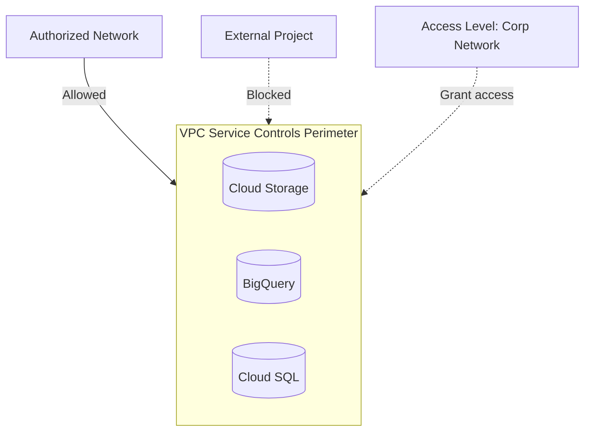

# Deploy VPC Service Controls for Data Exfiltration Prevention on GCP

This guide demonstrates how to use MechCloud's stateless IaC to provision VPC Service Controls perimeters for preventing data exfiltration from sensitive GCP services.

## Scenario Overview
**Use Case:** Data exfiltration prevention by creating security perimeters around sensitive GCP services (BigQuery, Cloud Storage, Cloud SQL) — ensuring that data cannot be copied to unauthorized projects even by users with IAM permissions.
**Key MechCloud Features Highlighted:**
- Cross-resource referencing (`ref:`)
- Service perimeter and access level configuration
- Access policy with ingress/egress rules

### Architecture Diagram



***

### Complete Unified Template

```yaml
resources:
  - type: gcp_access_context_manager_access_policy
    name: org-policy
    props:
      parent: "organizations/{{ORG_ID}}"
      title: "MechCloud Access Policy"

  - type: gcp_access_context_manager_access_level
    name: corp-network
    props:
      parent: "ref:org-policy"
      name: "mc_corp_network"
      title: "Corporate Network Access"
      basic:
        conditions:
          - ip_subnetworks:
              - "203.0.113.0/24"
              - "198.51.100.0/24"
          - regions:
              - "US"
              - "EU"

  - type: gcp_access_context_manager_access_level
    name: trusted-identity
    props:
      parent: "ref:org-policy"
      name: "mc_trusted_identity"
      title: "Trusted Service Accounts"
      basic:
        conditions:
          - members:
              - "serviceAccount:trusted-app@project.iam.gserviceaccount.com"

  - type: gcp_access_context_manager_service_perimeter
    name: data-perimeter
    props:
      parent: "ref:org-policy"
      name: "mc_data_perimeter"
      title: "Data Protection Perimeter"
      perimeter_type: PERIMETER_TYPE_REGULAR
      status:
        restricted_services:
          - "bigquery.googleapis.com"
          - "storage.googleapis.com"
          - "sqladmin.googleapis.com"
        resources:
          - "projects/{{PROJECT_NUMBER}}"
        access_levels:
          - "ref:corp-network"
          - "ref:trusted-identity"
        ingress_policies:
          - ingress_from:
              identity_type: ANY_IDENTITY
              sources:
                - access_level: "ref:corp-network"
            ingress_to:
              resources:
                - "*"
              operations:
                - service_name: "storage.googleapis.com"
                  method_selectors:
                    - method: "google.storage.objects.get"
                    - method: "google.storage.objects.list"
        egress_policies:
          - egress_from:
              identity_type: ANY_SERVICE_ACCOUNT
            egress_to:
              resources:
                - "projects/{{PROJECT_NUMBER}}"
              operations:
                - service_name: "bigquery.googleapis.com"
```
