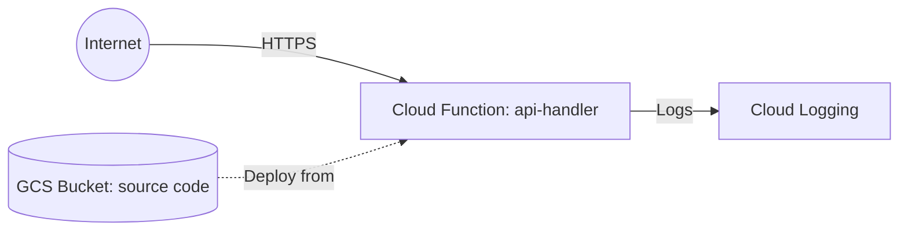

# Deploy Cloud Functions with HTTP Trigger on GCP

This guide demonstrates how to use MechCloud's stateless IaC to provision a Cloud Functions (2nd gen) function with an HTTP trigger for serverless API endpoints.

## Scenario Overview
**Use Case:** A serverless REST API that scales automatically and costs nothing when idle — ideal for webhooks, microservices, and lightweight APIs with variable traffic patterns on GCP.
**Key MechCloud Features Highlighted:**
- Cross-resource referencing (`ref:`)
- Function configuration with runtime and entry point
- No state management overhead

### Architecture Diagram



***

### Complete Unified Template

```yaml
resources:
  - type: gcp_storage_bucket
    name: func-source
    props:
      location: "{{CURRENT_REGION}}"
      uniform_bucket_level_access: true

  - type: gcp_storage_bucket_object
    name: func-zip
    props:
      bucket: "ref:func-source"
      name: "function-source.zip"
      source: "./function-source.zip"

  - type: gcp_cloudfunctions2_function
    name: api-handler
    props:
      location: "{{CURRENT_REGION}}"
      build_config:
        runtime: python312
        entry_point: handler
        source:
          storage_source:
            bucket: "ref:func-source"
            object: "ref:func-zip"
      service_config:
        max_instance_count: 10
        min_instance_count: 0
        available_memory: "256M"
        timeout_seconds: 60
        ingress_settings: ALLOW_ALL
        all_traffic_on_latest_revision: true

  - type: gcp_cloud_run_service_iam_member
    name: func-public
    props:
      location: "{{CURRENT_REGION}}"
      service: "ref:api-handler"
      role: roles/run.invoker
      member: allUsers
```
