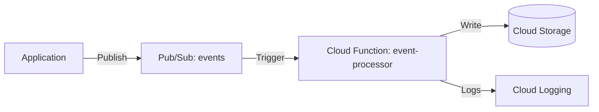

# Deploy Cloud Functions with Pub/Sub Trigger on GCP

This guide demonstrates how to use MechCloud's stateless IaC to provision a Cloud Functions (2nd gen) function triggered by Pub/Sub messages for event-driven processing.

## Scenario Overview
**Use Case:** Asynchronous event processing where a Cloud Function automatically processes messages from a Pub/Sub topic — ideal for data pipelines, notification systems, and decoupled microservices architectures.
**Key MechCloud Features Highlighted:**
- Cross-resource referencing (`ref:`)
- Pub/Sub topic and function integration
- Event-driven serverless architecture

### Architecture Diagram



***

### Complete Unified Template

```yaml
resources:
  - type: gcp_pubsub_topic
    name: events
    props:
      name: "mc-events"
      message_retention_duration: "86400s"

  - type: gcp_pubsub_topic
    name: dead-letter
    props:
      name: "mc-events-dlq"

  - type: gcp_storage_bucket
    name: func-source
    props:
      location: "{{CURRENT_REGION}}"
      uniform_bucket_level_access: true

  - type: gcp_storage_bucket_object
    name: func-zip
    props:
      bucket: "ref:func-source"
      name: "function-source.zip"
      source: "./function-source.zip"

  - type: gcp_service_account
    name: func-sa
    props:
      account_id: "mc-event-processor-sa"
      display_name: "Event Processor Function SA"

  - type: gcp_project_iam_member
    name: func-logging
    props:
      role: roles/logging.logWriter
      member: "serviceAccount:ref:func-sa.email"

  - type: gcp_cloudfunctions2_function
    name: event-processor
    props:
      location: "{{CURRENT_REGION}}"
      build_config:
        runtime: python312
        entry_point: process_event
        source:
          storage_source:
            bucket: "ref:func-source"
            object: "ref:func-zip"
      service_config:
        max_instance_count: 20
        min_instance_count: 0
        available_memory: "512M"
        timeout_seconds: 120
        service_account_email: "ref:func-sa.email"
      event_trigger:
        trigger_region: "{{CURRENT_REGION}}"
        event_type: google.cloud.pubsub.topic.v1.messagePublished
        pubsub_topic: "ref:events"
        retry_policy: RETRY_POLICY_RETRY

  - type: gcp_pubsub_subscription
    name: events-sub
    props:
      name: "mc-events-sub"
      topic: "ref:events"
      ack_deadline_seconds: 120
      dead_letter_policy:
        dead_letter_topic: "ref:dead-letter"
        max_delivery_attempts: 5
      retry_policy:
        minimum_backoff: "10s"
        maximum_backoff: "600s"
```
