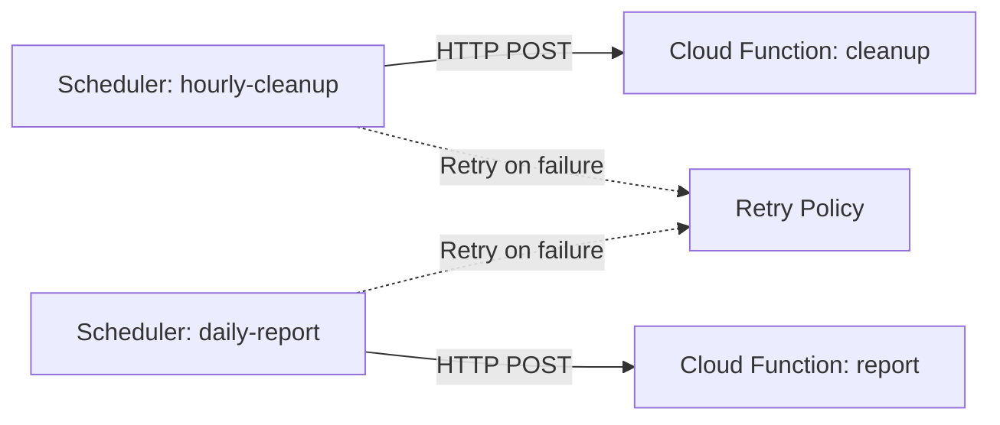

# Deploy Cloud Scheduler with Cloud Functions Target on GCP

This guide demonstrates how to use MechCloud's stateless IaC to provision Cloud Scheduler jobs that trigger Cloud Functions on a cron schedule for automated tasks.

## Scenario Overview
**Use Case:** Automated scheduled tasks like database cleanup, report generation, health checks, or data synchronization — replacing traditional cron jobs with a fully managed, serverless scheduling service.
**Key MechCloud Features Highlighted:**
- Cross-resource referencing (`ref:`)
- Cron schedule expression as clean YAML
- Multiple scheduled jobs in a single template

### Architecture Diagram



***

### Complete Unified Template

```yaml
resources:
  - type: gcp_service_account
    name: scheduler-sa
    props:
      account_id: "mc-scheduler-sa"
      display_name: "Cloud Scheduler Service Account"

  - type: gcp_project_iam_member
    name: scheduler-invoker
    props:
      role: roles/cloudfunctions.invoker
      member: "serviceAccount:ref:scheduler-sa.email"

  - type: gcp_storage_bucket
    name: func-source
    props:
      location: "{{CURRENT_REGION}}"
      uniform_bucket_level_access: true

  - type: gcp_storage_bucket_object
    name: func-zip
    props:
      bucket: "ref:func-source"
      name: "function-source.zip"
      source: "./function-source.zip"

  - type: gcp_cloudfunctions2_function
    name: cleanup-func
    props:
      location: "{{CURRENT_REGION}}"
      build_config:
        runtime: python312
        entry_point: cleanup
        source:
          storage_source:
            bucket: "ref:func-source"
            object: "ref:func-zip"
      service_config:
        max_instance_count: 1
        available_memory: "256M"
        timeout_seconds: 300

  - type: gcp_cloudfunctions2_function
    name: report-func
    props:
      location: "{{CURRENT_REGION}}"
      build_config:
        runtime: python312
        entry_point: generate_report
        source:
          storage_source:
            bucket: "ref:func-source"
            object: "ref:func-zip"
      service_config:
        max_instance_count: 1
        available_memory: "512M"
        timeout_seconds: 540

  - type: gcp_cloud_scheduler_job
    name: hourly-cleanup
    props:
      name: "mc-hourly-cleanup"
      region: "{{CURRENT_REGION}}"
      schedule: "0 * * * *"
      time_zone: "UTC"
      attempt_deadline: "320s"
      retry_config:
        retry_count: 3
        min_backoff_duration: "5s"
        max_backoff_duration: "300s"
      http_target:
        http_method: POST
        uri: "ref:cleanup-func.url"
        oidc_token:
          service_account_email: "ref:scheduler-sa.email"

  - type: gcp_cloud_scheduler_job
    name: daily-report
    props:
      name: "mc-daily-report"
      region: "{{CURRENT_REGION}}"
      schedule: "0 6 * * *"
      time_zone: "UTC"
      attempt_deadline: "600s"
      retry_config:
        retry_count: 2
      http_target:
        http_method: POST
        uri: "ref:report-func.url"
        oidc_token:
          service_account_email: "ref:scheduler-sa.email"
```
