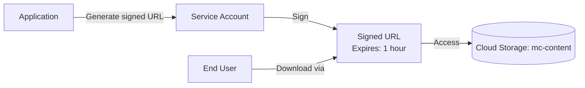

# Deploy Cloud Storage with Signed URLs for Secure Content Distribution on GCP

This guide demonstrates how to use MechCloud's stateless IaC to provision Cloud Storage buckets with service account keys for generating signed URLs for time-limited secure content access.

## Scenario Overview
**Use Case:** Securely distributing private content (software downloads, media files, documents) via time-limited signed URLs — allowing temporary access to private objects without making buckets public, ideal for SaaS file delivery and media streaming.
**Key MechCloud Features Highlighted:**
- Cross-resource referencing (`ref:`)
- Service account and IAM configuration
- Bucket with strict access controls

### Architecture Diagram



***

### Complete Unified Template

```yaml
resources:
  - type: gcp_service_account
    name: signing-sa
    props:
      account_id: "mc-url-signing-sa"
      display_name: "URL Signing Service Account"

  - type: gcp_project_iam_member
    name: signing-sa-token-creator
    props:
      role: roles/iam.serviceAccountTokenCreator
      member: "serviceAccount:ref:signing-sa.email"

  - type: gcp_storage_bucket
    name: content-bucket
    props:
      location: "{{CURRENT_REGION}}"
      storage_class: STANDARD
      uniform_bucket_level_access: true
      public_access_prevention: enforced
      versioning:
        enabled: true
      cors:
        - origin:
            - "https://app.example.com"
          method:
            - GET
            - HEAD
          response_header:
            - Content-Type
            - Content-Disposition
          max_age_seconds: 3600

  - type: gcp_storage_bucket_iam_member
    name: signing-sa-reader
    props:
      bucket: "ref:content-bucket"
      role: roles/storage.objectViewer
      member: "serviceAccount:ref:signing-sa.email"

  - type: gcp_storage_bucket
    name: uploads-bucket
    props:
      location: "{{CURRENT_REGION}}"
      storage_class: STANDARD
      uniform_bucket_level_access: true
      public_access_prevention: enforced
      lifecycle_rule:
        - action:
            type: Delete
          condition:
            age: 7

  - type: gcp_storage_bucket_iam_member
    name: signing-sa-uploader
    props:
      bucket: "ref:uploads-bucket"
      role: roles/storage.objectCreator
      member: "serviceAccount:ref:signing-sa.email"
```
