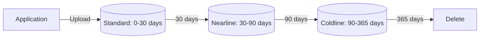

# Deploy Cloud Storage with Versioning and Lifecycle Policies on GCP

This guide demonstrates how to use MechCloud's stateless IaC to provision Cloud Storage buckets with object versioning and lifecycle rules for automated cost-optimized data management.

## Scenario Overview
**Use Case:** Automated data lifecycle management that transitions objects from Standard to Nearline to Coldline storage classes based on age — reducing storage costs by up to 90% for infrequently accessed data while maintaining object version history for recovery.
**Key MechCloud Features Highlighted:**
- Cross-resource referencing (`ref:`)
- Lifecycle rules as clean YAML
- Versioning and retention configuration

### Architecture Diagram



***

### Complete Unified Template

```yaml
resources:
  - type: gcp_storage_bucket
    name: data-bucket
    props:
      location: "{{CURRENT_REGION}}"
      storage_class: STANDARD
      uniform_bucket_level_access: true
      versioning:
        enabled: true
      lifecycle_rule:
        - action:
            type: SetStorageClass
            storage_class: NEARLINE
          condition:
            age: 30
            matches_storage_class:
              - STANDARD
        - action:
            type: SetStorageClass
            storage_class: COLDLINE
          condition:
            age: 90
            matches_storage_class:
              - NEARLINE
        - action:
            type: Delete
          condition:
            age: 365
        - action:
            type: Delete
          condition:
            num_newer_versions: 3
            with_state: ARCHIVED
      retention_policy:
        retention_period: 86400
      logging:
        log_bucket: "ref:logs-bucket"

  - type: gcp_storage_bucket
    name: logs-bucket
    props:
      location: "{{CURRENT_REGION}}"
      storage_class: NEARLINE
      uniform_bucket_level_access: true
      lifecycle_rule:
        - action:
            type: Delete
          condition:
            age: 90
```
