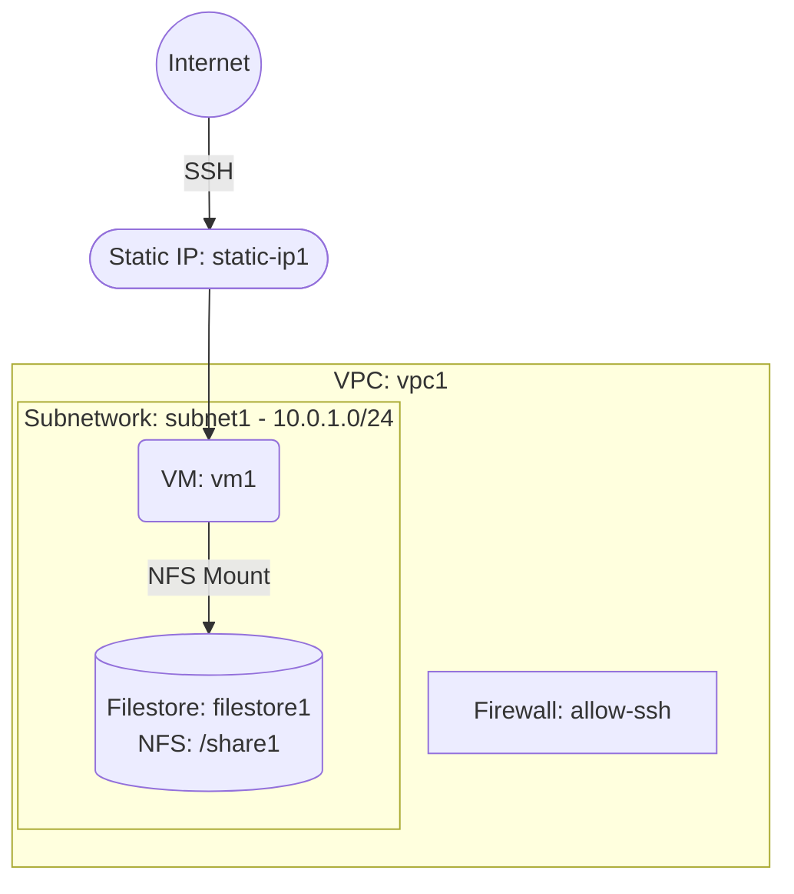

# Deploy a VM with Filestore for Shared NFS Storage on GCP

This guide demonstrates how to use MechCloud's stateless Infrastructure-as-Code (IaC) to provision a Compute Engine VM with a Filestore instance for shared NFS file storage on Google Cloud Platform.

In this scenario, we deploy a VM alongside a Filestore instance that provides a fully managed NFS file share. Filestore is ideal for workloads that need a shared file system accessible by multiple VMs, such as content management, media rendering, or shared application data.

## Scenario Overview
**Use Case:** An application that requires a high-performance, shared file system accessible via standard NFS protocol — such as shared configuration, media assets, or application logs across multiple compute instances.
**Key MechCloud Features Highlighted:**
- Hierarchical resource nesting (VPC → Subnetwork & Firewall)
- Cross-resource referencing (`ref:`)
- Filestore instance with NFS file share

### Architecture Diagram



***

### Complete Unified Template

```yaml
defaults:
  zone: us-central1-a

resources:
  - type: google_compute_network
    name: vpc1
    props:
      auto_create_subnetworks: false
    resources:
      - type: google_compute_subnetwork
        name: subnet1
        props:
          ip_cidr_range: "10.0.1.0/24"
          region: us-central1

      - type: google_compute_firewall
        name: allow-ssh
        props:
          direction: INGRESS
          priority: 1000
          source_ranges:
            - "{{CURRENT_IP}}/32"
          allow:
            - protocol: tcp
              ports:
                - "22"

  - type: google_compute_address
    name: static-ip1
    props:
      address_type: EXTERNAL
      region: us-central1

  - type: google_compute_instance
    name: vm1
    props:
      machine_type: e2-medium
      boot_disk:
        initialize_params:
          image: "{{Image|arm64_ubuntu_24_04}}"
          size: 20
      network_interfaces:
        - subnetwork: "ref:vpc1/subnet1"
          access_configs:
            - nat_ip: "ref:static-ip1"

  - type: google_filestore_instance
    name: filestore1
    props:
      tier: BASIC_HDD
      file_shares:
        - name: share1
          capacity_gb: 1024
      networks:
        - network: "ref:vpc1"
          modes:
            - MODE_IPV4
```
